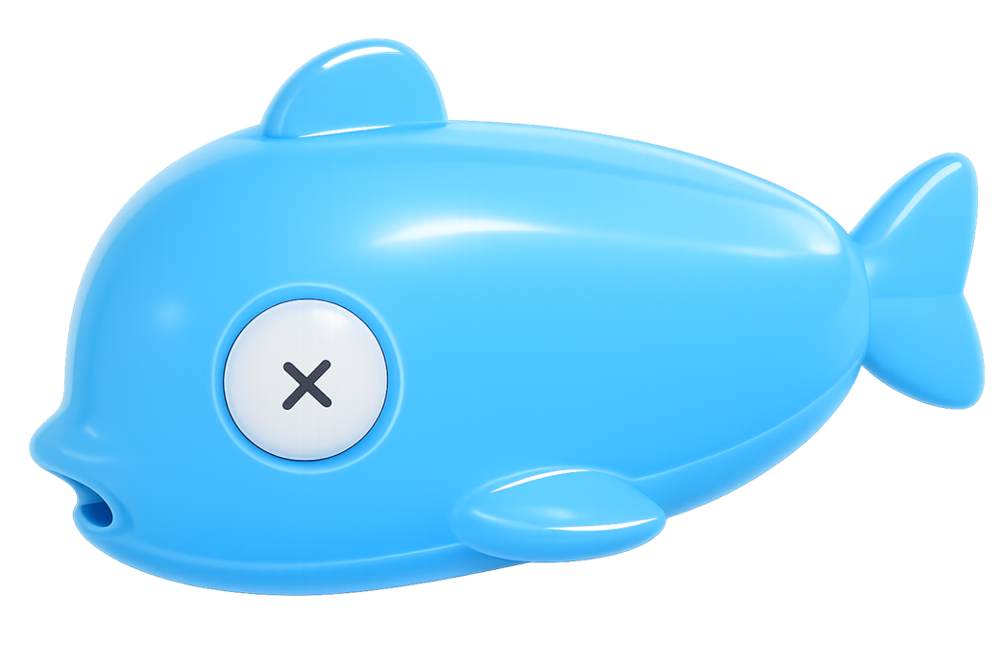
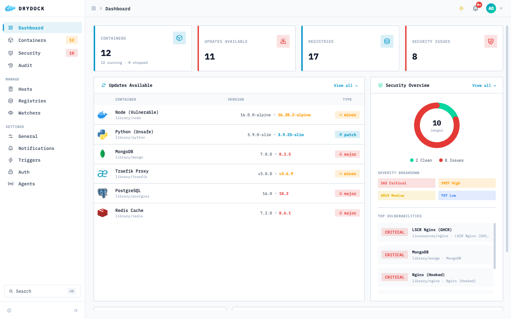
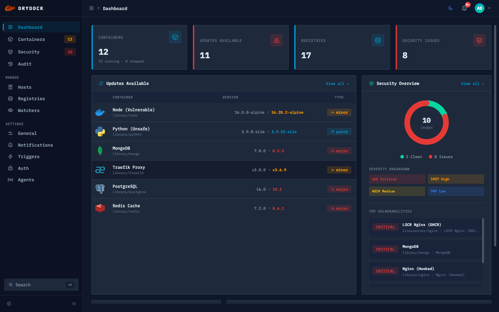
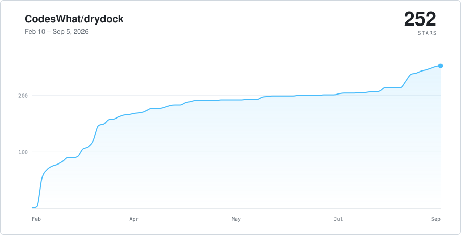

<div align="center">

<p><a href="README.md">English</a> · <a href="README.es.md">Español</a> · <a href="README.pl.md">Polski</a> · <a href="README.zh-CN.md">简体中文</a> · <a href="README.de.md">Deutsch</a> · <strong>Français</strong> · <a href="README.pt-BR.md">Português (Brasil)</a></p>

<picture>
  <source media="(prefers-color-scheme: dark)" srcset="docs/assets/whale-logo-dark.png" />
  <source media="(prefers-color-scheme: light)" srcset="docs/assets/whale-logo.png" />
  
</picture>

<h1>drydock</h1>

**Observateur de mise à jour d'image de conteneur : 23 registres, 20 fournisseurs de notifications et d'actions.**

</div>

<p align="center"><a href="https://github.com/CodesWhat/drydock/releases"></a>
  <a href="https://github.com/orgs/CodesWhat/packages/container/package/drydock"></a>
  <a href="LICENSE"></a>
  <br>
  <a href="https://github.com/CodesWhat/drydock/actions/workflows/ci-verify.yml"></a>
  <a href="https://securityscorecards.dev/viewer/?uri=github.com/CodesWhat/drydock"></a>
  <a href="https://www.bestpractices.dev/projects/11915"></a>
  <a href="https://qlty.sh/gh/CodesWhat/projects/drydock"></a>
  <a href="https://dashboard.stryker-mutator.io/reports/github.com/CodesWhat/drydock/main"></a>
  <a href="https://codecov.io/gh/CodesWhat/drydock"></a>
  <br>
  <a href="https://hub.docker.com/r/codeswhat/drydock"></a>
  <a href="https://github.com/CodesWhat/drydock/stargazers"></a>
  <a href="https://github.com/veggiemonk/awesome-docker#container-management"></a>
  <a href="https://crowdin.com/project/drydock"></a>
  <a href="https://github.com/sponsors/CodesWhat"></a>
</p>

<hr>

> [!WARNING]
> **Vous effectuez une mise à jour à partir d'une ancienne version ? Lisez d'abord les notes de mise à niveau.** Trois correctifs de renforcement de la sécurité ont été livrés pour la première fois dans **1.4.6** et sont exécutés sur toute la ligne **1.5**, de sorte que toute mise à jour à partir d'une version antérieure à 1.4.6 est affectée quelle que soit la version sur laquelle elle atterrit (1.4.6, toute version 1.5.x ou ultérieure). Ce ne sont pas des dépréciations et n'ont pas de période de grâce : OIDC nécessite désormais `authorization_endpoint` dans les métadonnées de découverte de votre fournisseur, des clés de limitation de débit non authentifiées sur l'adresse homologue TCP (compartiment partagé derrière un proxy inverse) et les URL de proxy déclencheur HTTP doivent utiliser `http(s)://`. Voir **[UPGRADE-NOTES.md](UPGRADE-NOTES.md)** avant la mise à jour.

<!-- separate alerts: a blank-line-only gap between blockquotes trips markdownlint MD028 -->

> [!WARNING]
> **Mise à niveau vers 1.6.0-rc.3 ou une version ultérieure ?** Des renforcements de sécurité supplémentaires s'appliquent sans délai de grâce. Une instance sans authentification configurée, ou avec l'accès anonyme activé mais non confirmé, échoue désormais en mode fermé lors d'une mise à niveau comme lors d'une nouvelle installation : le conteneur fonctionne, les requêtes API protégées renvoient `401`, les routes publiques de découverte et d'état d'authentification restent disponibles et `/health` renvoie `503`. L'interface SPA peut se charger, mais ne peut pas lire les données protégées. Définissez `DD_ANONYMOUS_AUTH_CONFIRM=true` ou configurez `DD_AUTH_BASIC_*`/OIDC avant la mise à niveau. Le cookie de session passe de `connect.sid` à `drydock.sid`, ce qui déconnecte une fois tous les utilisateurs. Les déclencheurs HTTP, le webhook Hass et les téléchargements d'icônes de registre utilisent désormais une résolution DNS protégée qui bloque les cibles de métadonnées cloud et link-local et ne suit jamais les redirections. Réservez `allowmetadata=true` à un déclencheur `DD_NOTIFICATION_HTTP_*` qui en a réellement besoin. Consultez **[DEPRECATIONS.md](DEPRECATIONS.md#enforced-security-changes-no-deprecation-window)** pour la procédure complète.

<h2 align="center">Contenu</h2>

- [Documentation](#documentation)
- [Démarrage rapide](#quick-start)
- [Mises à jour récentes](#recent-updates)
- [Captures d'écran et démo en direct](#screenshots)
- [Pourquoi Drydock](#why-drydock)
- [Caractéristiques](#features)
- [Intégrations prises en charge](#supported-integrations)
- [Comparaison des fonctionnalités](#feature-comparison)
- [Migration](#migration)
- [Feuille de route](#roadmap)
- [Historique des étoiles](#star-history)
- [Construit avec](#built-with)
- [Communauté et support](#community-support)
- [Écosystème CodesWhat](#codeswhat-ecosystem)

<h2 align="center" id="documentation">Documentations</h2>

| Ressource                 | Lien                                                                                                                     |
| ------------------------- | ------------------------------------------------------------------------------------------------------------------------ |
| Site Web                  | [getdrydock.com](https://getdrydock.com/)                                                                |
| Démo en direct            | [demo.getdrydock.com](https://demo.getdrydock.com)                                       |
| Documents                 | [getdrydock.com/docs](https://getdrydock.com/docs)                                                       |
| Configuration             | [Configuration](https://getdrydock.com/docs/configuration)                                                               |
| Démarrage rapide          | [Démarrage rapide](https://getdrydock.com/docs/quickstart)                                                               |
| Journal des modifications | [`CHANGELOG.md`](CHANGELOG.md)                                                                                           |
| Dépréciations             | [`DEPRECATIONS.md`](DEPRECATIONS.md)                                                                                     |
| Feuille de route          | Voir la section [Roadmap](#roadmap) ci-dessus                                                                            |
| Contribuer                | [`CONTRIBUTING.md`](CONTRIBUTING.md)                                                                                     |
| Code de conduite          | [`CODE_OF_CONDUCT.md`](CODE_OF_CONDUCT.md)                                                                               |
| Gouvernance               | [`GOVERNANCE.md`](GOVERNANCE.md)                                                                                         |
| Assurance de sécurité     | [`SECURITY-ASSURANCE.md`](SECURITY-ASSURANCE.md)                                                                         |
| Politique de sécurité     | [`SECURITY.md`](SECURITY.md)                                                                                             |
| Problèmes                 | [Problèmes GitHub](https://github.com/CodesWhat/drydock/issues)                                                          |
| Discussions               | [GitHub Discussions](https://github.com/CodesWhat/drydock/discussions) — demandes de fonctionnalités et idées bienvenues |

<hr>

<h2 align="center" id="quick-start">Démarrage rapide</h2>

**Recommandé : utilisez un proxy de socket** pour restreindre les points de terminaison de l'API Docker auxquels Drydock peut accéder. Cela évite de donner au conteneur un accès complet au socket Docker.

```yaml
services:
  drydock:
    image: codeswhat/drydock
    depends_on:
      socket-proxy:
        condition: service_healthy
    environment:
      - DD_WATCHER_LOCAL_HOST=socket-proxy
      - DD_WATCHER_LOCAL_PORT=2375
      - DD_AUTH_BASIC_ADMIN_USER=admin
      - "DD_AUTH_BASIC_ADMIN_HASH=<paste-argon2id-hash>"
    ports:
      - 3000:3000

  socket-proxy:
    image: tecnativa/docker-socket-proxy
    volumes:
      - /var/run/docker.sock:/var/run/docker.sock
    environment:
      - CONTAINERS=1
      - IMAGES=1
      - EVENTS=1
      - SERVICES=1
      - INFO=1          # Required for daemon identity detection (notification prefixes)
      # Add POST=1 and NETWORKS=1 for container actions and auto-updates
    healthcheck:
      test: wget --spider http://localhost:2375/version || exit 1
      interval: 5s
      timeout: 3s
      retries: 3
      start_period: 5s
    restart: unless-stopped
```

<details>
<summary>Alternative : <a href="https://github.com/CodesWhat/sockguard">sockguard</a> proxy de socket</summary>

[sockguard](https://github.com/CodesWhat/sockguard) est un filtre de socket Docker à refus par défaut du même écosystème CodesWhat, avec un préréglage conçu pour drydock :

```yaml
services:
  drydock:
    image: codeswhat/drydock
    depends_on:
      sockguard:
        condition: service_healthy
    environment:
      - DD_WATCHER_LOCAL_HOST=sockguard
      - DD_WATCHER_LOCAL_PORT=2375
      - DD_AUTH_BASIC_ADMIN_USER=admin
      - "DD_AUTH_BASIC_ADMIN_HASH=<paste-argon2id-hash>"
    ports:
      - 3000:3000

  sockguard:
    image: codeswhat/sockguard
    volumes:
      - /var/run/docker.sock:/var/run/docker.sock
      - ./sockguard.yaml:/etc/sockguard/config.yaml:ro
    environment:
      - SOCKGUARD_CONFIG_FILE=/etc/sockguard/config.yaml
    healthcheck:
      test: wget --spider http://localhost:2375/version || exit 1
      interval: 5s
      timeout: 3s
      retries: 3
      start_period: 5s
    restart: unless-stopped
```

Voir le préréglage [`app/configs/portwing.yaml`](https://github.com/CodesWhat/sockguard/blob/dev/v1.5/app/configs/portwing.yaml) de sockguard pour un `sockguard.yaml` de départ (le même préréglage portwing est livré dans ses propres exemples).

</details>

<details>
<summary>Alternative : démarrage rapide avec montage direct sur prise</summary>

```bash
docker run -d \
  --name drydock \
  -p 3000:3000 \
  -v /var/run/docker.sock:/var/run/docker.sock \
  -e DD_AUTH_BASIC_ADMIN_USER=admin \
  -e "DD_AUTH_BASIC_ADMIN_HASH=<paste-argon2id-hash>" \
  codeswhat/drydock:latest
```

> **Avertissement :** L'accès direct au socket accorde au conteneur un contrôle total sur le démon Docker. Utilisez la configuration du proxy de socket ci-dessus pour les déploiements de production. Consultez le [Docker Socket Security guide](https://getdrydock.com/docs/configuration/watchers#docker-socket-security) pour toutes les options, y compris TLS distant et Docker sans racine.

</details>

> Générez un hachage de mot de passe (`argon2` CLI — installation via votre gestionnaire de packages) :
>
> ```bash
> echo -n "yourpassword" | argon2 $(openssl rand -base64 32) -id -m 16 -t 3 -p 4 -l 64 -e
> ```
>
> Ou avec Node.js 24.7+ (aucun package supplémentaire nécessaire) :
>
> ```bash
> node -e 'const c=require("node:crypto");const s=c.randomBytes(32);const h=c.argon2Sync("argon2id",{message:process.argv[1],nonce:s,memory:65536,passes:3,parallelism:4,tagLength:64});console.log("argon2id$65536$3$4$"+s.toString("base64")+"$"+h.toString("base64"));' "yourpassword"
> ```
>
> Drydock v1.6 accepte uniquement les hachages d'authentification de base argon2id. Les anciens hachages `{SHA}`, `$apr1$`/`$1$`, `crypt` et en texte brut sont rejetés ; régénérez-les avant la mise à niveau.
> L'authentification est **requise par défaut**. Consultez le [auth docs](https://getdrydock.com/docs/configuration/authentications) pour OIDC, accès anonyme et autres options.
> L'accès anonyme doit être explicitement confirmé avec `DD_ANONYMOUS_AUTH_CONFIRM=true` sur les installations nouvelles comme mises à niveau. Sans cette confirmation, une instance sans authentification configurée, ou avec une authentification anonyme non confirmée, démarre en mode fermé : les requêtes API protégées renvoient `401`, les routes publiques de découverte et d'état de l'authentification restent disponibles, et `/health` renvoie `503`.

L'image comprend les binaires `trivy` et `cosign` pour l'analyse des vulnérabilités locales et la vérification des images.

Consultez le [Guide de démarrage rapide](https://getdrydock.com/docs/quickstart) pour Docker Compose, la sécurité des sockets, le proxy inverse et les registres alternatifs.

<hr>

<h2 align="center" id="recent-updates">Mises à jour récentes</h2>

<details open>
<summary><strong>Points forts de la v1.7.0-rc.4</strong></summary>

- **Les flux de logs WebSocket fonctionnent désormais derrière des proxys à terminaison TLS** : avec le trust proxy activé et `X-Forwarded-Proto` absent de la requête d'upgrade, la vérification d'origine ne se rabat plus sur l'état TLS du socket local (HTTP en clair derrière la terminaison TLS, ce qui faisait échouer chaque connexion navigateur avec un 403) ; le protocole est désormais traité comme inconnu et la validation de l'hôte reste inchangée. ([#867](https://github.com/CodesWhat/drydock/issues/867), [#868](https://github.com/CodesWhat/drydock/pull/868))
- **Les tags entiers nus ne dépassent plus les versions à points** : un tag de compteur de build comme `168` ne se convertit plus en un faux `168.0.0` qui dépasserait une vraie version comme `1.43.3`, à la fois dans le badge de tag suggéré et dans le chemin de récupération actionnable `includeTags`, qui partagent désormais une seule règle de partition afin de ne plus diverger. ([#859](https://github.com/CodesWhat/drydock/issues/859), [#871](https://github.com/CodesWhat/drydock/pull/871))
- **Les images de base éliminent six CVE HIGH d'OpenSSL** : les pins de digest de `node:24-alpine` et `alpine:3.24`, ainsi que le pin apk d'`openssl`, avancent vers OpenSSL 3.5.8-r0. ([#881](https://github.com/CodesWhat/drydock/pull/881))
- **Le site de démonstration envoie désormais l'ensemble complet des en-têtes de sécurité** : les en-têtes signalés comme manquants par DAST sur la surface de démonstration sont désormais envoyés. ([#878](https://github.com/CodesWhat/drydock/pull/878))

Notes complètes dans [CHANGELOG.md](./CHANGELOG.md#170-rc4--2026-08-26).

</details>

<details>
<summary><strong>Points forts de la v1.7.0-rc.3</strong></summary>

- **Les tunnels Portwing edge transportent désormais des corps non JSON** : la trame de bienvenue du contrôleur annonce désormais la capacité `edge-response-body-b64` et décode les corps de réponse Docker négociés en base64 (par exemple la réponse texte brut « OK » de `_ping`) provenant des agents qui la prennent en charge ; additif et conditionné par la capacité. ([#852](https://github.com/CodesWhat/drydock/pull/852))
- **Les badges du README se lisent désormais en direct** : les badges de version, de licence, de téléchargements et d'étoiles se génèrent désormais à partir de points de terminaison shields.io en direct au lieu d'images statiques, et le graphique d'historique des étoiles se présente désormais comme une paire claire/sombre adaptée au thème, régénérée lors de la coupe de version plutôt que par cron. ([#851](https://github.com/CodesWhat/drydock/pull/851), [#844](https://github.com/CodesWhat/drydock/pull/844), [#847](https://github.com/CodesWhat/drydock/pull/847))
- **Les portes DAST et de lint des workflows échouent désormais de façon fermée** : les analyses ZAP n'ignorent plus tous les avertissements, et l'étape zizmor en pre-push échoue avec une indication d'installation au lieu d'être ignorée silencieusement lorsque le binaire est absent. ([#842](https://github.com/CodesWhat/drydock/pull/842))
- **Un contrôle quotidien vérifie que `main` porte une étiquette de version** : un workflow planifié et en lecture seule passe au rouge si le HEAD de `main` n'est pas étiqueté. ([#846](https://github.com/CodesWhat/drydock/pull/846))
- **Corrections du pipeline de version** : la rupture CI de la coupe rc.2 est corrigée : une surcharge js-yaml erronée qui cassait les tests de charge Artillery est annulée, et deux attentes Playwright sont élargies au-delà des budgets propres de l'application. ([#829](https://github.com/CodesWhat/drydock/pull/829), [#836](https://github.com/CodesWhat/drydock/pull/836))

Notes complètes dans [CHANGELOG.md](./CHANGELOG.md#170-rc3--2026-08-23).

</details>

<details>
<summary><strong>Points forts de la v1.7.0-rc.2</strong></summary>

- **Résolution de la politique d'action par conteneur** : l'API et l'interface exposent désormais l'état résolu (blocked/manual/auto) et le déclencheur gagnant pour chaque conteneur, ainsi qu'un nouveau label `dd.action.auto` et le mode `AUTO=onauto` pour un accès manuel uniquement, sans déclenchement automatique.
- **Changements incompatibles ce cycle** : `DD_TRIGGER_*`/`dd.trigger.*` sont totalement supprimés, `trigger-excluded`/`trigger-not-included` deviennent des blocages de mise à jour définitifs, la disposition des sujets MQTT de Home Assistant inclut désormais un segment `agent/<name>` par défaut, `GET /api/auth/methods` renvoie 410, et `curl` a disparu de l'image.
- **Corrections de justesse des vérifications de mise à jour** : une erreur de registre en cours de vérification n'indique plus à tort « Up to date », un conteneur malformé n'annule plus toute la synchronisation d'inventaire d'un agent, et les index d'image OCI imbriqués se résolvent désormais vers le manifeste réel. ([#814](https://github.com/CodesWhat/drydock/issues/814))
- **Corrections de dépendances et d'auto-mise à jour** : un membre de dépendance rejeté conserve son contexte de redémarrage, les rafraîchissements Compose ne reportent plus de valeurs d'environnement obsolètes héritées de l'image, et les substitutions de politique de mise à jour survivent désormais à l'auto-mise à jour de drydock. ([#718](https://github.com/CodesWhat/drydock/pull/718), [#736](https://github.com/CodesWhat/drydock/pull/736), [#743](https://github.com/CodesWhat/drydock/pull/743))
- **Sécurité** : fermeture d'une voie d'injection de propriété distante dans la synchronisation des requêtes d'URL de la liste des conteneurs, et restriction de la porte Grype pour l'image autour d'un CVE Alpine en attente de correctif amont. ([#750](https://github.com/CodesWhat/drydock/pull/750))

Notes complètes dans [CHANGELOG.md](./CHANGELOG.md#170-rc2--2026-08-20).

</details>

<details>
<summary><strong>Points forts de la v1.7.0-rc.1</strong></summary>

- **Mises à jour tenant compte des dépendances** : les labels ou métadonnées Compose construisent un graphe de dépendances validé, prévisualisent les vagues exactes et exécutent les mises à jour ou redémarrages des dépendants dans un ordre déterministe, avec gestion sûre des cycles, échecs et aperçus périmés. ([Discussion #219](https://github.com/CodesWhat/drydock/discussions/219))
- **Expérience opérateur** : PWA installable, liens de ports nommés cliquables, durée d'exécution des conteneurs en direct, raccourcis clavier et détection temporisée des nouveaux conteneurs.
- **Migration incompatible des déclencheurs** : `DD_TRIGGER_*` bloque désormais le démarrage et les anciens labels `dd.trigger.include` / `dd.trigger.exclude` n'acheminent plus de tâches ; utilisez `DD_ACTION_*`, `DD_NOTIFICATION_*` et leurs labels à portée dédiée.
- **Renforcement de la sécurité et du cycle de vie** : l'authentification, les requêtes d'agents, les journaux, les WebSockets et les requêtes de registres sont explicitement bornés ; les valeurs sensibles de commandes et hooks sont masquées ; la découverte Home Assistant se resynchronise après le démarrage et retire les tâches des fournisseurs sans publication périmée. ([#708](https://github.com/CodesWhat/drydock/issues/708))

Notes complètes dans [CHANGELOG.md](./CHANGELOG.md#170-rc1--2026-08-14).

</details>

<details>
<summary><strong>Points forts de la v1.6.0</strong></summary>

- **Le transport Edge/agent Portwing arrive à maturité** avec les vérifications et mises à jour Docker natives pilotées par le contrôleur pour Portwing 0.9.0+, les journaux Edge continus, la signature Ed25519 v2 et les noms d'affichage liés à la clé de l'agent. ([#632](https://github.com/CodesWhat/drydock/issues/632), [#637](https://github.com/CodesWhat/drydock/issues/637))
- **Politique de mise à jour déclarative avec stabilisation de maturité** : priorité `dd.updatePolicy.*` à trois niveaux, compte à rebours et notification `maturity-cleared`. ([Discussion #307](https://github.com/CodesWhat/drydock/discussions/307), [Discussion #406](https://github.com/CodesWhat/drydock/discussions/406))
- **Modèles par règle, préférences de cloche et événement `container-unhealthy`**, avec MQTT Home Assistant bidirectionnel dont le bouton Installer déclenche une véritable mise à jour. ([Discussion #205](https://github.com/CodesWhat/drydock/discussions/205), [Discussion #198](https://github.com/CodesWhat/drydock/discussions/198))
- **Toutes les vues de liste principales sont adaptatives** grâce à une `DataTable` partagée et un basculement table/carte persistant. ([#498](https://github.com/CodesWhat/drydock/issues/498))
- **Parité `/api/v1` terminée** : suppression de `/api/*` et `WS /api/log/stream` (`410 Gone`), avec le shim facultatif `DD_COMPAT_WUDCARD`. ([Discussion #469](https://github.com/CodesWhat/drydock/discussions/469))
- **Sécurité renforcée** : accès anonyme fermé lors des mises à niveau, protection SSRF des déclencheurs HTTP, contrôle d'origine WebSocket complet et cookie `drydock.sid`.

Notes complètes dans [CHANGELOG.md](./CHANGELOG.md#160--2026-08-11).

</details>

<details>
<summary><strong>Points forts de la v1.6.0-rc.13</strong></summary>

- **Comparaison des digests par dépôts correspondants** : `getOrderedRepoDigests` filtre les `RepoDigests` et répare automatiquement les ancres obsolètes. ([#670](https://github.com/CodesWhat/drydock/pull/670))
- **`nanoid` fixé à 3.3.18** dans tous les espaces de travail pour CVE-2026-67213 et CVE-2026-67214. ([#673](https://github.com/CodesWhat/drydock/pull/673))
- **Star History auto-hébergé** via la route même origine `/api/star-history`, mise en cache avec SVG de secours. ([#672](https://github.com/CodesWhat/drydock/pull/672))
- **Mise à jour des images de base** : `node:24-alpine` passe à Node 24.19.0 et l'étape `aquasec/trivy` à 0.73.0. ([#682](https://github.com/CodesWhat/drydock/pull/682))
- **Résolution des alias d'icônes** et contrôle exhaustif du bundle. ([#683](https://github.com/CodesWhat/drydock/pull/683))

</details>

<details>
<summary><strong>Points forts de la v1.6.0-rc.12</strong></summary>

- **Dépendances de sécurité actualisées** : `brace-expansion` 5.0.9, `ip-address` 10.3.1 et `fast-uri` 4.1.2. ([#659](https://github.com/CodesWhat/drydock/pull/659))
- **Horloge de maturité cohérente** : l'affichage et le blocage utilisent `updatePolicy.maturityMinAgeDays`, et les erreurs de date passent de `debug` à `warn`. ([#604](https://github.com/CodesWhat/drydock/issues/604))
- **Grâce d'enregistrement des agents** pour les blocages transitoires `agent-mismatch` et `no-update-trigger-configured`, tout en conservant une admission fermée. ([#605](https://github.com/CodesWhat/drydock/issues/605))
- **Journaux WebSocket et accès anonyme** compatibles lorsque ce mode est enregistré. ([#636](https://github.com/CodesWhat/drydock/issues/636))
- **Réponses 501 explicites** pour les actions sans transport Docker du contrôleur. ([#637](https://github.com/CodesWhat/drydock/issues/637))

</details>

<details>
<summary><strong>Points forts de la v1.6.0-rc.11</strong></summary>

- **Transport Portwing** : les marqueurs `transport=docker-api`, `execution=controller`, `events=portwing` activent Standard HTTP ou Edge authentifié pour les vérifications, mises à jour, actions de cycle de vie, aperçus et restaurations pilotés par le contrôleur. Portwing reste la source des événements de cycle de vie, et l'inventaire brut ne peut pas effacer les résultats de mise à jour enrichis par le contrôleur. ([#632](https://github.com/CodesWhat/drydock/issues/632), [#637](https://github.com/CodesWhat/drydock/issues/637), [Portwing #76](https://github.com/CodesWhat/portwing/issues/76))
- **Notifications** — Modèles de titre et de corps par règle/par fournisseur avec aperçu en direct, ainsi que des catégories de cloches dans l'application basées sur un audit et des seuils de gravité de mise à jour.
- **Tableau de bord** — Remplacement de la grille CSS sans dépendance avec réorganisation souris/tactile, redimensionnement limité, mises en page réactives, visibilité des widgets, réinitialisation et synchronisation facultative des préférences entre appareils.
- **Politique de mise à jour** — Priorité déclarative de l'observateur/étiquette/interface utilisateur, remplacement/annulation de la piste d'audit, compte à rebours de maturité/remplacement manuel et visibilité des informations sur les balises épinglées avec une vue empilée des balises actuelles → plus récentes.
- **Ressources du conteneur** — La colonne Ressources reste visible par défaut, mais peut être masquée durablement ; les liens vers la source, les notes de version et le registre restent disponibles dans le menu Plus et les pieds de carte.
- **Performances et récupération** — Déduplication de liste de balises par interrogation, projections globales plus légères, historiques de journaux virtualisés volumineux, basculement de journaux en direct immuable, délai d'expiration de l'authentification, migrations complètes des préférences et auto-réparation des fragments obsolètes.
- **Migrations v1.6 appliquées** — Les alias d'environnement/label WUD, les formats d'authentification hérités, les commutateurs d'observateur obsolètes, les alias de modèle, Kafka `clientId` et les configurations publiques Hub/DHI malformées réservées aux jetons uniquement ne s'exécutent plus. Les alias de taxonomie de déclencheur restent conservés pour une dernière version d'avertissement de niveau d'erreur.

Conseils de migration complets dans [DEPRECATIONS.md](./DEPRECATIONS.md).

</details>

<details>
<summary><strong>Points forts de la v1.5.2</strong></summary>

- **Politique de mise à jour sécurisée pour les loisirs** — Les portes de maturité, les balises/récapitulatifs ignorés et les répétitions survivent désormais à la récréation des conteneurs pour les charges de travail des agents locaux et distants.
- **Fiabilité des balises épinglées** — Les balises entièrement épinglées détectent à nouveau les reconstructions de résumé de même balise, tandis que l'interface utilisateur peut afficher une balise de même famille plus récente et non exploitable sans modifier le comportement de mise à jour ou de déclenchement.
- **Récupération par restauration** — L'échec de la création d'un remplacement, de l'attachement au réseau ou du démarrage nettoie désormais le candidat avant de restaurer le conteneur d'origine, et les échecs répétés ne peuvent pas se répercuter sur les renommages de restauration imbriqués.
- **Recréation de conteneurs plus sûre** — Les adresses MAC attribuées par le démon ne sont plus épinglées sur les remplacements, tandis que les adresses MAC du réseau principal explicitement configurées restent préservées.
- **Interrogation d'images locales plus silencieuse** — Les images créées ou chargées localement sans résumé de registre ignorent les recherches à distance au lieu de générer des erreurs d'autorisation récurrentes.

Historique complet dans [CHANGELOG.md](./CHANGELOG.md).

</details>

<hr>

<h2 align="center" id="screenshots">Captures d'écran et démo en direct</h2>

<p align="center">
  
</p>

<p align="center"><em>Repérez une mise à jour, voyez exactement quels changements, appliquez-la. Sauvegarde, vérification de l'état et restauration gérées.</em></p>

<table>
<tbody><tr>
<td width="50%" align="center"><strong>Lumière</strong></td>
<td width="50%" align="center"><strong>Sombre</strong></td>
</tr>
<tr>
<td></td>
<td></td>
</tr>
</tbody></table>

<div align="center">

**Pourquoi regarder des captures d'écran quand vous pouvez en faire l'expérience vous-même ?**

<a href="https://demo.getdrydock.com"></a>

Entièrement interactif : véritable interface utilisateur, données fictives, aucune installation requise. Fonctionne entièrement dans le navigateur.

</div>

<hr>

<h2 align="center" id="why-drydock">Pourquoi Drydock</h2>

Les images de conteneurs deviennent obsolètes en silence. Une image de base corrige un CVE, une application supprime une version, une balise se déplace. À moins que vous ne surveilliez chaque registre à la main, vos conteneurs en cours d'exécution prennent du retard jusqu'à ce que quelque chose se brise ou soit exploité.

La plupart des outils imposent un compromis. Les mises à jour automatiques (Watchtower, Ouroboros) s'exécutent et redémarrent avec peu de visibilité ou de contrôle, et ne sont désormais en grande partie pas entretenues. Les tableaux de bord (Portainer) gèrent les conteneurs mais ne sont pas conçus pour l'intelligence des mises à jour. Drydock est **surveillant d'abord** : il surveille 23 registres et vous indique exactement ce qui a changé (majeur, mineur, correctif ou résumé) avant que quoi que ce soit ne se produise, puis n'agit que lorsque vous l'autorisez. Et cela va plus loin que n’importe lequel d’entre eux. L'analyse des vulnérabilités Trivy/Grype bloque les mises à jour dangereuses, Cosign vérifie les signatures, les sauvegardes d'images préalables à la mise à jour sont automatiquement annulées en cas d'échec du contrôle de santé, les agents distribués couvrent les hôtes distants et 20 intégrations de notifications et d'actions bouclent la boucle. Le cycle de vie complet des mises à jour, avec une interface utilisateur Web et une API REST.

<hr>

<h2 align="center" id="features">Caractéristiques</h2>

| | Fonctionnalité | Descriptif |
| --- | ------------------------------------------------------ | ------------------------------------------------------------------------------------------------------------------------------------------------------------------------------------------------------------------------------------------------------------------------------------------------------------------------------------------------------------------------------------------------------------------------------------------------------------------------------------------------------------------------------------------------------------------------------------------- |
| 🔭  | **Détection sur le moniteur en premier**               | Surveille chaque conteneur en cours d'exécution et classe chaque mise à jour disponible comme majeure, mineure, correctif ou résumé avant que quoi que ce soit ne se produise. Rien ne change jusqu'à ce que vous le disiez.                                                                                                                                                                                                                                                                                                                                |
| 📦  | **23 fournisseurs de registre**                        | Docker Hub, GHCR, ECR, ACR, GCR, GAR, GitLab, Quay, Harbor, Artifactory, Nexus et 12 autres. Public et privé, cloud et auto-hébergé, avec TLS et authentification par registre.                                                                                                                                                                                                                                                                                                                                                                             |
| 🔔  | **20 déclencheurs**                                    | 17 canaux de notification (Slack, Discord, Telegram, Teams, SMTP, MQTT, ntfy et plus) ainsi que des actions Docker, Docker Compose et Command, avec des modèles par événement/fournisseur, un aperçu en direct, un filtrage de seuil et un mode batch.                                                                                                                                                                                                                                                                                                   |
| 🥊  | **Update Bouncer**                                     | L'analyse des vulnérabilités Trivy/Grype bloque les mises à jour dangereuses avant leur déploiement, avec vérification de la signature Cosign et génération SBOM (CycloneDX et SPDX).                                                                                                                                                                                                                                                                                                                                                                    |
| ↩️  | **Sauvegarde d'image et restauration automatique**     | Pré-mettez à jour les instantanés d'image avec conservation configurable, restauration automatique en cas d'échec du contrôle de santé et restauration manuelle en un clic depuis l'interface utilisateur.                                                                                                                                                                                                                                                                                                                                                                  |
| 🪝  | **Crochets de cycle de vie**                           | Commandes shell avant et après la mise à jour via des étiquettes de conteneur, avec délais d'attente par hook et contrôle d'abandon en cas d'échec.                                                                                                                                                                                                                                                                                                                                                                                                                         |
| 🗂️ | **Mises à jour Docker Compose**                        | Extrayez et recréez les services Compose via l'API Docker Engine avec des correctifs d'image préservant YAML.                                                                                                                                                                                                                                                                                                                                                                                                                                                               |
| 🎛️ | **Politique par conteneur**                            | Les règles de balise Regex et le routage des déclencheurs utilisent les étiquettes `dd.*` ; les portes de maturité, les sauts/répétitions/épingles et les fenêtres de maintenance sont stockés via l'interface utilisateur/API ou la configuration de l'observateur.                                                                                                                                                                                                                                                                                                        |
| 🛰️ | **Agents distribués**                                  | Surveillez les hôtes Docker distants via SSE. Les agents Portwing 0.9.0+ utilisent Standard HTTP entrant ou le transport WebSocket Edge sortant ; Drydock 1.6.0-rc.11+ exécute côté contrôleur les vérifications natives de registre et les mises à jour Docker individuelles ou groupées par l'un ou l'autre chemin authentifié. Edge transporte aussi les journaux continus sans port entrant ; `DD_EXPERIMENTAL_PORTWING=false` reste l'arrêt d'urgence. |
| 🖥️ | **Tableau de bord Web**                                | Interface utilisateur Vue 3 avec une grille de widgets personnalisable sans dépendance, des vues de table/carte réactives, des mises à jour SSE en direct, des contrôles de cloche de notification et des détails, journaux et statistiques par conteneur.                                                                                                                                                                                                                                                                                                                  |
| 🔗  | **API REST et webhooks**                               | Points de terminaison authentifiés par jeton pour les déclencheurs de surveillance et de mise à jour CI/CD, ainsi que l'ingestion de webhooks de registre signés pour les événements push.                                                                                                                                                                                                                                                                                                                                                                                  |
| 🔐  | **Authentification OIDC**                              | Sécurisez le tableau de bord avec OpenID Connect (Authelia, Auth0, Authentik). Par défaut, tous les flux d’authentification refusent l’accès en cas d’échec (fail-closed).                                                                                                                                                                                                                                                                                                                                                               |
| 📈  | **Métriques Prometheus**                               | Point de terminaison `/metrics` intégré avec contournement d'authentification en option pour les piles de surveillance Prometheus et Grafana.                                                                                                                                                                                                                                                                                                                                                                                                                               |
| 🌍  | **17 paramètres régionaux de l'interface utilisateur** | Système de traduction entièrement câblé avec anglais complet et 16 paramètres régionaux gérés par la communauté synchronisés via Crowdin, commutables dans Config.                                                                                                                                                                                                                                                                                                                                                                                                          |
| 🔒  | **Regex immunitaire ReDoS**                            | Chaque modèle de balise fourni par l'utilisateur est compilé via re2js (un port pur JS RE2) pour une correspondance temporelle linéaire qui ne peut pas être bloquée par un modèle de retour en arrière catastrophique.                                                                                                                                                                                                                                                                                                                                  |

<hr>

<h2 align="center" id="supported-integrations">Supported Integrations</h2>

### Registres (23)

Docker Hub · GHCR · ECR · ACR · GCR · GAR · GitLab · Quay · LSCR · Port · Artefact · Nexus · Gitea · Forgejo · Codeberg · MAU · TrueForge · Personnalisé · DOCR · DHI · IBM Cloud · Oracle Cloud · Alibaba Cloud

### Actions (3)

Docker · Docker Compose · Commande

### Notifications (17)

Apprise · Discord · Google Chat · Gotify · HTTP · IFTTT · Kafka · Matrix · Mattermost · MQTT · MS Teams · NTFY · Pushover · Rocket.Chat · Slack · SMTP · Telegram

### Authentification

Anonyme (inscription via `DD_ANONYMOUS_AUTH_CONFIRM=true`) · Basique (nom d'utilisateur + hachage du mot de passe) · OIDC (Authelia, Auth0, Authentik). Par défaut, tous les flux d’authentification refusent l’accès en cas d’échec (fail-closed).

### Update Bouncer

L'analyse des vulnérabilités basée sur Trivy ou Grype bloque les mises à jour dangereuses avant leur déploiement. Comprend la vérification de la signature Cosign et la génération SBOM (CycloneDX et SPDX).

<hr>

<h2 align="center" id="feature-comparison">Comparaison des fonctionnalités</h2>

<details>
<summary><strong>Comment drydock se compare-t-il aux autres outils de mise à jour de conteneurs ?</strong></summary>

> ✅ = pris en charge &nbsp; ❌ = non pris en charge &nbsp; ⚠️ = partiel / limité &nbsp; † = archivé, n'est plus conservé

<table>
<thead>
<tr>
<th width="28%">Fonctionnalité</th>
<th width="15%" align="center">drydock</th>
<th width="15%" align="center">WUD</th>
<th width="15%" align="center">Diun</th>
<th width="13%" align="center"><em>Watchtower †</em></th>
<th width="14%" align="center"><em>Ouroboros †</em></th>
</tr>
</thead>
<tbody>
<tr><td>Interface web / tableau de bord</td><td align="center">✅</td><td align="center">✅</td><td align="center">❌</td><td align="center">❌</td><td align="center">❌</td></tr>
<tr><td>Mise à jour automatique des conteneurs</td><td align="center">✅</td><td align="center">✅</td><td align="center">❌</td><td align="center">✅</td><td align="center">✅</td></tr>
<tr><td>Mises à jour Docker Compose</td><td align="center">✅</td><td align="center">✅</td><td align="center">❌</td><td align="center">⚠️</td><td align="center">❌</td></tr>
<tr><td>Canaux de déclenchement / notification</td><td align="center">20</td><td align="center">16</td><td align="center">17</td><td align="center">~19</td><td align="center">~6</td></tr>
<tr><td>Fournisseurs de registres</td><td align="center">23</td><td align="center">13</td><td align="center">⚠️</td><td align="center">⚠️</td><td align="center">⚠️</td></tr>
<tr><td>Authentification OIDC / SSO</td><td align="center">✅</td><td align="center">✅</td><td align="center">❌</td><td align="center">❌</td><td align="center">❌</td></tr>
<tr><td>API REST</td><td align="center">✅</td><td align="center">✅</td><td align="center">⚠️</td><td align="center">⚠️</td><td align="center">❌</td></tr>
<tr><td>Métriques Prometheus</td><td align="center">✅</td><td align="center">✅</td><td align="center">❌</td><td align="center">✅</td><td align="center">✅</td></tr>
<tr><td>MQTT / Home Assistant</td><td align="center">✅</td><td align="center">✅</td><td align="center">✅</td><td align="center">❌</td><td align="center">❌</td></tr>
<tr><td>Sauvegarde et restauration d'images</td><td align="center">✅</td><td align="center">❌</td><td align="center">❌</td><td align="center">❌</td><td align="center">❌</td></tr>
<tr><td>Regroupement de conteneurs / piles</td><td align="center">✅</td><td align="center">✅</td><td align="center">❌</td><td align="center">⚠️</td><td align="center">❌</td></tr>
<tr><td>Hooks de cycle de vie (avant/après)</td><td align="center">✅</td><td align="center">❌</td><td align="center">❌</td><td align="center">✅</td><td align="center">❌</td></tr>
<tr><td>API webhook pour CI/CD</td><td align="center">✅</td><td align="center">❌</td><td align="center">❌</td><td align="center">✅</td><td align="center">❌</td></tr>
<tr><td>Démarrer/arrêter/redémarrer/mettre à jour</td><td align="center">✅</td><td align="center">❌</td><td align="center">❌</td><td align="center">❌</td><td align="center">❌</td></tr>
<tr><td>Agents distribués (distants)</td><td align="center">✅</td><td align="center">❌</td><td align="center">✅</td><td align="center">⚠️</td><td align="center">❌</td></tr>
<tr><td>Journal d'audit</td><td align="center">✅</td><td align="center">❌</td><td align="center">❌</td><td align="center">❌</td><td align="center">❌</td></tr>
<tr><td>Analyse de sécurité (Trivy/Grype)</td><td align="center">✅</td><td align="center">❌</td><td align="center">❌</td><td align="center">❌</td><td align="center">❌</td></tr>
<tr><td>Mises à jour compatibles SemVer</td><td align="center">✅</td><td align="center">✅</td><td align="center">✅</td><td align="center">❌</td><td align="center">❌</td></tr>
<tr><td>Surveillance des digests</td><td align="center">✅</td><td align="center">✅</td><td align="center">✅</td><td align="center">✅</td><td align="center">✅</td></tr>
<tr><td>Multiarchitecture (amd64/arm64)</td><td align="center">✅</td><td align="center">✅</td><td align="center">✅</td><td align="center">✅</td><td align="center">✅</td></tr>
<tr><td>Visionneuse de journaux de conteneur</td><td align="center">✅</td><td align="center">❌</td><td align="center">❌</td><td align="center">❌</td><td align="center">❌</td></tr>
<tr><td>Maintenance active</td><td align="center">✅</td><td align="center">✅</td><td align="center">✅</td><td align="center">❌</td><td align="center">❌</td></tr>
</tbody>
</table>

> Données basées sur une documentation accessible au public en mars 2026.
> Les contributions sont les bienvenues si des informations sont inexactes.

</details>

<hr>

<h2 align="center" id="migration">Migration</h2>

<details>
<summary><strong>Migration depuis WUD (What's Up Docker ?)</strong></summary>

Drydock v1.6 ne charge plus les variables d'environnement `WUD_*` ou les étiquettes `wud.*` au moment de l'exécution. Réécrivez-les avant de démarrer le service mis à niveau ; l'état persistant migre toujours automatiquement. Utilisez `docker exec -it drydock node dist/index.js config migrate --dry-run` pour prévisualiser, puis `docker exec -it drydock node dist/index.js config migrate --file .env --file compose.yaml` pour réécrire la configuration en dénomination `DD_*` et `dd.*`.

</details>

<hr>

<h2 align="center" id="roadmap">Feuille de route</h2>

<details>
<summary><strong>Thèmes et faits saillants de la version</strong></summary>

Cette orientation couvre au moins les douze prochains mois, jusqu'en août 2027.
Thèmes généraux uniquement ; consultez [CHANGELOG.md](CHANGELOG.md) pour les détails de chaque version.

| Version                                      | Thème                                                    | Faits saillants                                                                                                                                                                                                                                                                                                                                                                                                                                                                                                                                                                                                                                                                                                                                                                                                                                                                                                                                                                                                                                                                                                                                                                                                                                                                                                                                                                                                                                                                                                                                                                                                                                                                                                                                                                                                                                                                                                                                                                                                                                                             |
| -------------------------------------------- | -------------------------------------------------------- | --------------------------------------------------------------------------------------------------------------------------------------------------------------------------------------------------------------------------------------------------------------------------------------------------------------------------------------------------------------------------------------------------------------------------------------------------------------------------------------------------------------------------------------------------------------------------------------------------------------------------------------------------------------------------------------------------------------------------------------------------------------------------------------------------------------------------------------------------------------------------------------------------------------------------------------------------------------------------------------------------------------------------------------------------------------------------------------------------------------------------------------------------------------------------------------------------------------------------------------------------------------------------------------------------------------------------------------------------------------------------------------------------------------------------------------------------------------------------------------------------------------------------------------------------------------------------------------------------------------------------------------------------------------------------------------------------------------------------------------------------------------------------------------------------------------------------------------------------------------------------------------------------------------------------------------------------------------------------------------------------------------------------------------------------------------------------- |
| **v1.3.x** ✅ | Sécurité et stabilité                                    | Analyse Trivy, Update Bouncer, SBOM, 7 nouveaux registres, 4 nouveaux déclencheurs, moteur regex re2js                                                                                                                                                                                                                                                                                                                                                                                                                                                                                                                                                                                                                                                                                                                                                                                                                                                                                                                                                                                                                                                                                                                                                                                                                                                                                                                                                                                                                                                                                                                                                                                                                                                                                                                                                                                                                                                                                                                                                                      |
| **v1.4.x** ✅ | Modernisation et renforcement de l'interface utilisateur | Tailwind 4 + composants personnalisés, 6 thèmes, palette Cmd/K, OpenAPI 3.1, mises à jour YAML natives, analyse à double emplacement, renforcement OIDC                                                                                                                                                                                                                                                                                                                                                                                                                                                                                                                                                                                                                                                                                                                                                                                                                                                                                                                                                                                                                                                                                                                                                                                                                                                                                                                                                                                                                                                                                                                                                                                                                                                                                                                                                                                                                                                                                                     |
| **v1.5.0** ✅ | Observabilité & i18n                 | répartition de la taxonomie de déclenchement (`DD_ACTION_*`/`DD_NOTIFICATION_*`), visionneuse de journaux WebSocket, personnalisation du tableau de bord, surveillance des ressources, boîte d'envoi de notification + DLQ, résumé d'analyse de sécurité, 17 paramètres régionaux, relecture de l'ID du dernier événement SSE, appel sortant de l'agent Edge avec authentification Ed25519 (expérimental, `DD_EXPERIMENTAL_PORTWING=true`)                                                                                                                                                                                                                                                                                                                                                                                                                                                                                                                                                                                                                                                                                                                                                                                                                                                                                                                                                                                                                                                                                                                                                                                                                                                                                                                                                                                                                                                                                                                                                                                            |
| **v1.5.1** ✅ | Sécurité et maintenance                                  | Correction d'authentification par extraction GCR/GAR, achèvement du registre TLS (M-2), renforcement par injection d'environnement de crochet, prise en charge de `DD_SESSION_SECRET__FILE`, suppression des informations d'identification de débogage, vérification des autorisations de fichiers secrets, correction de l'impasse de la porte de maturité, traductibilité complète de l'interface utilisateur + traductions communautaires, porte d'application automatique de la fenêtre de maintenance, affichage de la disponibilité du conteneur, version du logiciel de surfaçage de colonne Tag/Version (étiquette OCI, avec double écriture `dd.inspect.tag.path` + routage `dd.inspect.tag.version-only` opt-in), correspondance de préfixe de montage de composition opt-in, modèle `${currentReleaseNotes}` var                                                                                                                                                                                                                                                                                                                                                                                                                                                                                                                                                                                                                                                                                                                                                                                                                                                                                                                                                                                                                                                                                                                                                                                                           |
| **v1.5.2** ✅ | Politique et fiabilité des balises épinglées             | Rétention des politiques de maturité/saut/répétition sécurisées pour les loisirs, détection de reconstruction de résumé de balises épinglées et informations informationnelles sur la même famille, nettoyage des candidats à l'annulation, prévention des cascades d'annulation, préservation MAC explicite et comportement de saut de registre d'images locales                                                                                                                                                                                                                                                                                                                                                                                                                                                                                                                                                                                                                                                                                                                                                                                                                                                                                                                                                                                                                                                                                                                                                                                                                                                                                                                                                                                                                                                                                                                                                                                                                                                                                                           |
| **v1.6.0**   | Notifications, politiques et versions Intel              | Modèles de notification par règle/par déclencheur avec aperçu en direct, préférences de cloche de notification, synchronisation des préférences entre appareils, grille de tableau de bord personnalisée sans dépendance ([#281](https://github.com/CodesWhat/drydock/issues/281)), politique de mise à jour déclarative ([#320](https://github.com/CodesWhat/drydock/issues/320)), compte à rebours de stabilisation de la maturité + visibilité immédiate des candidats + remplacement manuel ([#406](https://github.com/CodesWhat/drydock/discussions/406)), panneau d'état de mise à jour exploitable et global Mode de mise à jour `notify` / `manual` / `auto` ([#325](https://github.com/CodesWhat/drydock/discussions/325)), héritage de stratégie de balise observateur/imgset/conteneur plus courant empilé → visibilité de balise épinglée plus récente ([#498](https://github.com/CodesWhat/drydock/issues/498)), source 44px standardisée/notes de version/actions de ressources de registre dans la table, les cartes et les détails ([#295](https://github.com/CodesWhat/drydock/discussions/295)), notifications d'événements d'état de santé ([#198](https://github.com/CodesWhat/drydock/discussions/198)), Home Assistant bidirectionnel MQTT, vues de table/liste de cartes réactives, Trivy/Grype/les deux analyses via des commandes ou des backends Docker-worker épinglés, contrôles d'extraction/chauffage des ressources du scanner, SBOM dédupliqué hors tas stockage, exactitude de l'analyse longue Trivy ([#490](https://github.com/CodesWhat/drydock/issues/490)), avertissements de migration de taxonomie de déclenchement, suppressions de compatibilité v1.6, hygiène des documents/API et achèvement de la migration `/api` → `/api/v1` avec une cale de compatibilité opt-in wud-card/page d'accueil (`DD_COMPAT_WUDCARD`). |
| **v1.7.0**   | Mises à jour intelligentes et UX                         | Ordre tenant compte des dépendances ([#219](https://github.com/CodesWhat/drydock/discussions/219)), mises à jour sélectives en masse ([#232](https://github.com/CodesWhat/drydock/discussions/232)), politique de mise à jour par action ([#511](https://github.com/CodesWhat/drydock/discussions/511)), élagage d'image, surveillance d'image statique, indicateur de maturité d'image, horloge unifiée de maturité/âge des mises à jour, liens de port cliquables, raccourcis clavier, PWA, suppression de `DD_TRIGGER_*` (fin de la fenêtre de dépréciation de la v1.5.0), curl supprimé de l'image                                                                                                                                                                                                                                                                                                                                                                                                                                                                                                                                                                                                                                                                                                                                                                                                                                                                                                                                                                                                                                                                                                                                                                                                                                                                                                                                                          |
| **v1.8.0**   | Gestion de flotte et configuration en direct             | Configuration YAML, configuration de l'interface utilisateur en direct, navigateur de volumes, mises à jour parallèles, migration du magasin SQLite                                                                                                                                                                                                                                                                                                                                                                                                                                                                                                                                                                                                                                                                                                                                                                                                                                                                                                                                                                                                                                                                                                                                                                                                                                                                                                                                                                                                                                                                                                                                                                                                                                                                                                                                                                                                                                                                                                                         |
| **v2.0+**                    | Extension de la plateforme et au-delà                    | Observateurs Swarm/Kubernetes, GitOps, barrières de santé, déploiements Canary, terminal Web, RBAC, clés API rotatives étendues (jetons de support statiques pour les intégrations HA/tableau de bord, [#469](https://github.com/CodesWhat/drydock/discussions/469)), LDAP/AD, fournisseur Podman natif au-delà de l'API compatible Docker, CLI, image renforcée Wolfi, proxy de socket                                                                                                                                                                                                                                                                                                                                                                                                                                                                                                                                                                                                                                                                                                                                                                                                                                                                                                                                                                                                                                                                                                                                                                                                                                                                                                                                                                                                                                                                                                                                                                                                                                                                  |

</details>

<hr>

<h2 align="center" id="star-history">Historique des étoiles</h2>

<div align="center">
  <a href="https://github.com/CodesWhat/drydock/stargazers">
    
  </a>
</div>

---

<div align="center">

<h2 align="center" id="built-with">Construit avec</h2>

[](https://www.typescriptlang.org/)
[](https://vuejs.org/)
[](https://expressjs.com/)
[](https://vitest.dev/)
[](https://biomejs.dev/)
[](https://nodejs.org/)
[](https://claude.ai/)
[![OpenAI](https://img.shields.io/badge/OpenAI-10A37F?logo=data%3Aimage%2Fsvg%2Bxml%3Bbase64%2CPHN2ZyByb2xlPSJpbWciIHZpZXdCb3g9IjAgMCAyNCAyNCIgeG1sbnM9Imh0dHA6Ly93d3cudzMub3JnLzIwMDAvc3ZnIj48dGl0bGU%2BT3BlbkFJPC90aXRsZT48cGF0aCBmaWxsPSIjZmZmZmZmIiBkPSJNMjIuMjgxOSA5LjgyMTFhNS45ODQ3IDUuOTg0NyAwIDAgMC0uNTE1Ny00LjkxMDggNi4wNDYyIDYuMDQ2MiAwIDAgMC02LjUwOTgtMi45QTYuMDY1MSA2LjA2NTEgMCAwIDAgNC45ODA3IDQuMTgxOGE1Ljk4NDcgNS45ODQ3IDAgMCAwLTMuOTk3NyAyLjkgNi4wNDYyIDYuMDQ2MiAwIDAgMCAuNzQyNyA3LjA5NjYgNS45OCA1Ljk4IDAgMCAwIC41MTEgNC45MTA3IDYuMDUxIDYuMDUxIDAgMCAwIDYuNTE0NiAyLjkwMDFBNS45ODQ3IDUuOTg0NyAwIDAgMCAxMy4yNTk5IDI0YTYuMDU1NyA2LjA1NTcgMCAwIDAgNS43NzE4LTQuMjA1OCA1Ljk4OTQgNS45ODk0IDAgMCAwIDMuOTk3Ny0yLjkwMDEgNi4wNTU3IDYuMDU1NyAwIDAgMC0uNzQ3NS03LjA3Mjl6bS05LjAyMiAxMi42MDgxYTQuNDc1NSA0LjQ3NTUgMCAwIDEtMi44NzY0LTEuMDQwOGwuMTQxOS0uMDgwNCA0Ljc3ODMtMi43NTgyYS43OTQ4Ljc5NDggMCAwIDAgLjM5MjctLjY4MTN2LTYuNzM2OWwyLjAyIDEuMTY4NmEuMDcxLjA3MSAwIDAgMSAuMDM4LjA1MnY1LjU4MjZhNC41MDQgNC41MDQgMCAwIDEtNC40OTQ1IDQuNDk0NHptLTkuNjYwNy00LjEyNTRhNC40NzA4IDQuNDcwOCAwIDAgMS0uNTM0Ni0zLjAxMzdsLjE0Mi4wODUyIDQuNzgzIDIuNzU4MmEuNzcxMi43NzEyIDAgMCAwIC43ODA2IDBsNS44NDI4LTMuMzY4NXYyLjMzMjRhLjA4MDQuMDgwNCAwIDAgMS0uMDMzMi4wNjE1TDkuNzQgMTkuOTUwMmE0LjQ5OTIgNC40OTkyIDAgMCAxLTYuMTQwOC0xLjY0NjR6TTIuMzQwOCA3Ljg5NTZhNC40ODUgNC40ODUgMCAwIDEgMi4zNjU1LTEuOTcyOFYxMS42YS43NjY0Ljc2NjQgMCAwIDAgLjM4NzkuNjc2NWw1LjgxNDQgMy4zNTQzLTIuMDIwMSAxLjE2ODVhLjA3NTcuMDc1NyAwIDAgMS0uMDcxIDBsLTQuODMwMy0yLjc4NjVBNC41MDQgNC41MDQgMCAwIDEgMi4zNDA4IDcuODcyem0xNi41OTYzIDMuODU1OEwxMy4xMDM4IDguMzY0IDE1LjExOTIgNy4yYS4wNzU3LjA3NTcgMCAwIDEgLjA3MSAwbDQuODMwMyAyLjc5MTNhNC40OTQ0IDQuNDk0NCAwIDAgMS0uNjc2NSA4LjEwNDJ2LTUuNjc3MmEuNzkuNzkgMCAwIDAtLjQwNy0uNjY3em0yLjAxMDctMy4wMjMxbC0uMTQyLS4wODUyLTQuNzczNS0yLjc4MThhLjc3NTkuNzc1OSAwIDAgMC0uNzg1NCAwTDkuNDA5IDkuMjI5N1Y2Ljg5NzRhLjA2NjIuMDY2MiAwIDAgMSAuMDI4NC0uMDYxNWw0LjgzMDMtMi43ODY2YTQuNDk5MiA0LjQ5OTIgMCAwIDEgNi42ODAyIDQuNjZ6TTguMzA2NSAxMi44NjNsLTIuMDItMS4xNjM4YS4wODA0LjA4MDQgMCAwIDEtLjAzOC0uMDU2N1Y2LjA3NDJhNC40OTkyIDQuNDk5MiAwIDAgMSA3LjM3NTctMy40NTM3bC0uMTQyLjA4MDVMOC43MDQgNS40NTlhLjc5NDguNzk0OCAwIDAgMC0uMzkyNy42ODEzem0xLjA5NzYtMi4zNjU0bDIuNjAyLTEuNDk5OCAyLjYwNjkgMS40OTk4djIuOTk5NGwtMi41OTc0IDEuNDk5Ny0yLjYwNjctMS40OTk3WiIvPjwvc3ZnPg%3D%3D)](https://openai.com)

[](https://semver.org/)
[](https://www.conventionalcommits.org/)
[](https://keepachangelog.com/)

<h2 align="center" id="community-support">Communauté et support</h2>

Chat en temps réel et assistance précoce : **[CodesWhat Discord](https://discord.gg/mWHCPJRzSx)**

Les bogues et les demandes de fonctionnalités concrètes vont dans **[GitHub Issues](https://github.com/CodesWhat/drydock/issues)** ; les questions ouvertes, idées et démonstrations vont dans **[GitHub Discussions](https://github.com/CodesWhat/drydock/discussions)** ; le chat en temps réel se passe sur **[CodesWhat Discord](https://discord.gg/mWHCPJRzSx)**.

### Contrôle qualité de la communauté

Merci aux utilisateurs qui ont aidé à tester les versions candidates v1.4.0 et v1.5.0 et qui ont signalé des bugs :

[@RK62](https://github.com/RK62) &middot; [@flederohr](https://github.com/flederohr) &middot; [@rj10rd](https://github.com/rj10rd) &middot; [@larueli](https://github.com/larueli) &middot; [@Waler](https://github.com/Waler) &middot; [@ElVit](https://github.com/ElVit) &middot; [@nchieffo](https://github.com/nchieffo) &middot; [@begunfx](https://github.com/begunfx) &middot; [@Ra72xx](https://github.com/Ra72xx)

<h2 align="center" id="codeswhat-ecosystem">Fait partie de l'écosystème CodesWhat</h2>

<table>
  <tbody><tr><th>Outil</th><th>Rôle</th></tr>
  <tr><td><b>drydock</b></td><td>Surveillance des mises à jour des conteneurs : interface utilisateur Web et moteur de notification</td></tr>
  <tr><td><a href="https://github.com/CodesWhat/portwing"><b>portwing</b></a></td><td>Agent Docker distant : accès sécurisé au niveau du socket à partir de Drydock ou autonome</td></tr>
  <tr><td><a href="https://github.com/CodesWhat/sockguard"><b>sockguard</b></a></td><td>Docker socket proxy - filtre de liste blanche de refus par défaut protégeant le socket</td></tr>
</tbody></table>

Ces trois outils sont conçus pour superposer : sockguard filtre le socket, portwing l'expose à distance et drydock surveille et agit sur l'état du conteneur.

Voir le [COMPATIBILITY.md de portwing](https://github.com/CodesWhat/portwing/blob/main/COMPATIBILITY.md) pour connaître la matrice de compatibilité complète des trois outils.

---

**[Licence AGPL-3.0](LICENSE)**

<a href="https://github.com/CodesWhat">
  <picture>
    <source media="(prefers-color-scheme: dark)" srcset="docs/assets/codeswhat-logo-dark.svg" />
    <source media="(prefers-color-scheme: light)" srcset="docs/assets/codeswhat-logo-original.svg" />
    
  </picture>
</a>

<a href="#drydock">Retour en haut</a>

</div>
