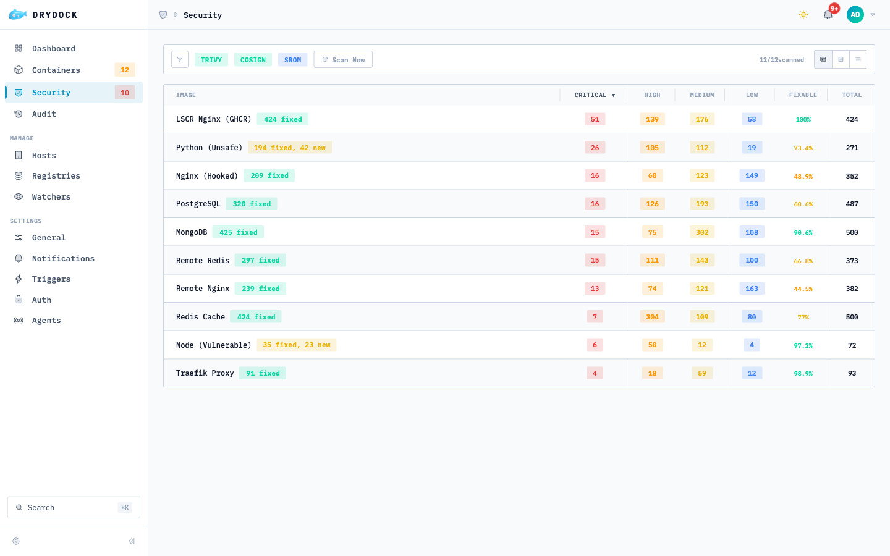
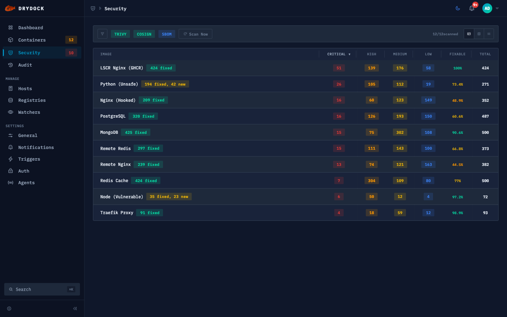

<div align="center">


<h1>drydock</h1>

**Open source container update monitoring — built in TypeScript with modern tooling.**

</div>

<p align="center">
  <a href="https://github.com/CodesWhat/drydock/releases"></a>
  <a href="https://github.com/CodesWhat/drydock/pkgs/container/drydock"></a>
  <a href="https://hub.docker.com/r/codeswhat/drydock"></a>
  <a href="https://quay.io/repository/codeswhat/drydock"></a>
  <br>
  <a href="https://github.com/orgs/CodesWhat/packages/container/package/drydock"></a>
  <a href="https://github.com/orgs/CodesWhat/packages/container/package/drydock"></a>
  <a href="LICENSE"></a>
</p>

<p align="center">
  <a href="https://github.com/CodesWhat/drydock/stargazers"></a>
  <a href="https://github.com/CodesWhat/drydock/forks"></a>
  <a href="https://github.com/CodesWhat/drydock/issues"></a>
  <a href="https://github.com/CodesWhat/drydock/commits/main"></a>
  <a href="https://github.com/CodesWhat/drydock/commits/main"></a>
  <br>
  <a href="https://github.com/CodesWhat/drydock/discussions"></a>
  <a href="https://github.com/CodesWhat/drydock"></a>
  
</p>

<p align="center">
  <a href="https://github.com/CodesWhat/drydock/actions/workflows/ci.yml"></a>
  <a href="https://www.bestpractices.dev/projects/11915"></a>
  <a href="https://securityscorecards.dev/viewer/?uri=github.com/CodesWhat/drydock"></a>
  <br>
  <a href="https://app.codecov.io/gh/CodesWhat/drydock"></a>
  <a href="https://qlty.sh/gh/CodesWhat/projects/drydock"></a>
  <a href="https://snyk.io/test/github/CodesWhat/drydock?targetFile=app/package.json"></a>
</p>

<hr>

<h2 align="center">📑 Contents</h2>

- [📖 Documentation](https://drydock.codeswhat.com/docs)
- [🚀 Quick Start](#quick-start)
- [📸 Screenshots](#screenshots)
- [✨ Features](#features)
- [🔌 Supported Integrations](#supported-integrations)
- [⚖️ Feature Comparison](#feature-comparison)
- [🔄 Migration](#migration)
- [🗺️ Roadmap](#roadmap)
- [📖 Documentation](#documentation)
- [⭐ Star History](#star-history)
- [🔧 Built With](#built-with)

<hr>

<h2 align="center" id="quick-start">🚀 Quick Start</h2>

```bash
docker run -d \
  --name drydock \
  -p 3000:3000 \
  -v /var/run/docker.sock:/var/run/docker.sock \
  -e DD_AUTH_BASIC_ADMIN_USER=admin \
  -e "DD_AUTH_BASIC_ADMIN_HASH={SHA}W6ph5Mm5Pz8GgiULbPgzG37mj9g=" \
  codeswhat/drydock:latest
```

> The example hash above is for the password `password` — generate your own with `htpasswd -nbs admin yourpassword`.
> Authentication is **required by default**. See the [auth docs](https://drydock.codeswhat.com/docs/configuration/authentications) for OIDC, anonymous access, and other options.
> To explicitly allow anonymous access on fresh installs, set `DD_ANONYMOUS_AUTH_CONFIRM=true`.

The image includes `trivy` and `cosign` binaries for local vulnerability scanning and image verification.

See the [Quick Start guide](https://drydock.codeswhat.com/docs/quickstart) for Docker Compose, socket security, reverse proxy, and alternative registries.

<hr>

<h2 align="center" id="screenshots">📸 Screenshots</h2>

<details open>
<summary><strong>Dashboard</strong></summary>
<table>
<tr>
<td width="50%" align="center"><strong>Light</strong></td>
<td width="50%" align="center"><strong>Dark</strong></td>
</tr>
<tr>
<td></td>
<td></td>
</tr>
</table>
</details>

<details>
<summary><strong>Containers</strong></summary>
<table>
<tr>
<td width="50%" align="center"><strong>Light</strong></td>
<td width="50%" align="center"><strong>Dark</strong></td>
</tr>
<tr>
<td></td>
<td></td>
</tr>
</table>
</details>

<details>
<summary><strong>Container Detail</strong></summary>
<table>
<tr>
<td width="50%" align="center"><strong>Light</strong></td>
<td width="50%" align="center"><strong>Dark</strong></td>
</tr>
<tr>
<td></td>
<td></td>
</tr>
</table>
</details>

<details>
<summary><strong>Security</strong></summary>
<table>
<tr>
<td width="50%" align="center"><strong>Light</strong></td>
<td width="50%" align="center"><strong>Dark</strong></td>
</tr>
<tr>
<td></td>
<td></td>
</tr>
</table>
</details>

<details>
<summary><strong>Login</strong></summary>
<table>
<tr>
<td width="50%" align="center"><strong>Light</strong></td>
<td width="50%" align="center"><strong>Dark</strong></td>
</tr>
<tr>
<td></td>
<td></td>
</tr>
</table>
</details>

<details>
<summary><strong>Mobile Responsive</strong></summary>
<table>
<tr>
<td width="25%" align="center"><strong>Dashboard Light</strong></td>
<td width="25%" align="center"><strong>Dashboard Dark</strong></td>
<td width="25%" align="center"><strong>Containers Light</strong></td>
<td width="25%" align="center"><strong>Containers Dark</strong></td>
</tr>
<tr>
<td></td>
<td></td>
<td></td>
<td></td>
</tr>
</table>
</details>

<hr>

<h2 align="center" id="features">✨ Features</h2>

<table>
<tr>
<td align="center" width="33%">
<h3>Container Monitoring</h3>
Auto-detect running containers and check for image updates across registries
</td>
<td align="center" width="33%">
<h3>20 Notification Triggers</h3>
Slack, Discord, Telegram, Teams, Matrix, SMTP, MQTT, HTTP webhooks, Gotify, NTFY, and more
</td>
<td align="center" width="33%">
<h3>23 Registry Providers</h3>
Docker Hub, GHCR, ECR, GCR, GAR, GitLab, Quay, Harbor, Artifactory, Nexus, and more
</td>
</tr>
<tr>
<td align="center">
<h3>Docker Compose Updates</h3>
Auto-pull and recreate services via docker-compose with service-scoped compose image patching
</td>
<td align="center">
<h3>Distributed Agents</h3>
Monitor remote Docker hosts with SSE-based agent architecture
</td>
<td align="center">
<h3>Audit Log</h3>
Event-based audit trail with persistent storage, REST API, and Prometheus counter
</td>
</tr>
<tr>
<td align="center" width="33%">
<h3>OIDC Authentication</h3>
Authelia, Auth0, Authentik — secure your dashboard with OpenID Connect
</td>
<td align="center" width="33%">
<h3>Prometheus Metrics</h3>
Built-in /metrics endpoint with optional auth bypass for monitoring stacks
</td>
<td align="center" width="33%">
<h3>Image Backup & Rollback</h3>
Automatic pre-update image backup with configurable retention and one-click rollback
</td>
</tr>
<tr>
<td align="center" width="33%">
<h3>Container Actions</h3>
Start, stop, restart, and update containers from the UI or API with feature-flag control
</td>
<td align="center" width="33%">
<h3>Webhook API</h3>
Token-authenticated HTTP endpoints for CI/CD integration to trigger watch cycles and updates
</td>
<td align="center" width="33%">
<h3>Container Grouping</h3>
Smart stack detection via compose project or labels with collapsible groups and batch-update
</td>
</tr>
<tr>
<td align="center" width="33%">
<h3>Lifecycle Hooks</h3>
Pre/post-update shell commands via container labels with configurable timeout and abort control
</td>
<td align="center" width="33%">
<h3>Auto Rollback</h3>
Automatic rollback on health check failure with configurable monitoring window and interval
</td>
<td align="center" width="33%">
<h3>Graceful Self-Update</h3>
DVD-style animated overlay during drydock's own container update with auto-reconnect
</td>
</tr>
<tr>
<td align="center" width="33%">
<h3>Icon CDN</h3>
Auto-resolved container icons via selfhst/icons with homarr-labs fallback and bundled selfhst seeds for internetless startup
</td>
<td align="center" width="33%">
<h3>Mobile Responsive</h3>
Fully responsive dashboard with optimized mobile breakpoints for all views
</td>
<td align="center" width="33%">
<h3>Multi-Registry Publishing</h3>
Available on GHCR, Docker Hub, and Quay.io for flexible deployment
</td>
</tr>
</table>

<hr>

<h2 align="center" id="supported-integrations">🔌 Supported Integrations</h2>

### 📦 Registries (23)

Docker Hub · GHCR · ECR · ACR · GCR · GAR · GitLab · Quay · LSCR · Harbor · Artifactory · Nexus · Gitea · Forgejo · Codeberg · MAU · TrueForge · Custom · DOCR · DHI · IBM Cloud · Oracle Cloud · Alibaba Cloud

### 🔔 Triggers (20)

Apprise · Command · Discord · Docker · Docker Compose · Google Chat · Gotify · HTTP · IFTTT · Kafka · Matrix · Mattermost · MQTT · MS Teams · NTFY · Pushover · Rocket.Chat · Slack · SMTP · Telegram

### 🔐 Authentication

Anonymous (opt-in via `DD_ANONYMOUS_AUTH_CONFIRM=true`) · Basic (username + password hash) · OIDC (Authelia, Auth0, Authentik). All auth flows fail closed by default.

API note: `POST /api/containers/:id/env/reveal` is currently scoped to authentication only (no per-container RBAC yet), so any authenticated user is treated as a trusted operator for secret reveal actions.

OpenAPI note: machine-readable API docs are available at `GET /api/v1/openapi.json` (canonical) and `GET /api/openapi.json` (compatibility alias during transition).

API versioning note: third-party integrations should migrate to `/api/v1/*`. The unversioned `/api/*` alias is planned for removal in a future major release (target: v2.0.0).

### 🥊 Update Bouncer

Trivy-powered vulnerability scanning blocks unsafe updates before they deploy. Includes cosign signature verification and SBOM generation (CycloneDX & SPDX).

<hr>

<h2 align="center" id="feature-comparison">⚖️ Feature Comparison</h2>

<details>
<summary><strong>How does drydock compare to other container update tools?</strong></summary>

> ✅ = supported &nbsp; ❌ = not supported &nbsp; ⚠️ = partial / limited &nbsp; For the full itemized changelog, see [CHANGELOG.md](CHANGELOG.md).

<table>
<thead>
<tr>
<th width="28%">Feature</th>
<th width="14%" align="center">drydock</th>
<th width="14%" align="center">WUD</th>
<th width="14%" align="center">Diun</th>
<th width="16%" align="center">Watchtower&nbsp;†</th>
<th width="14%" align="center">Ouroboros&nbsp;†</th>
</tr>
</thead>
<tbody>
<tr><td>Web UI / Dashboard</td><td align="center">✅</td><td align="center">✅</td><td align="center">❌</td><td align="center">❌</td><td align="center">❌</td></tr>
<tr><td>Auto-update containers</td><td align="center">✅</td><td align="center">✅</td><td align="center">❌</td><td align="center">✅</td><td align="center">✅</td></tr>
<tr><td>Docker Compose updates</td><td align="center">✅</td><td align="center">✅</td><td align="center">❌</td><td align="center">⚠️</td><td align="center">❌</td></tr>
<tr><td>Notification triggers</td><td align="center">20</td><td align="center">16</td><td align="center">17</td><td align="center">~19</td><td align="center">~6</td></tr>
<tr><td>Registry providers</td><td align="center">23</td><td align="center">13</td><td align="center">⚠️</td><td align="center">⚠️</td><td align="center">⚠️</td></tr>
<tr><td>OIDC / SSO authentication</td><td align="center">✅</td><td align="center">✅</td><td align="center">❌</td><td align="center">❌</td><td align="center">❌</td></tr>
<tr><td>REST API</td><td align="center">✅</td><td align="center">✅</td><td align="center">⚠️</td><td align="center">⚠️</td><td align="center">❌</td></tr>
<tr><td>Prometheus metrics</td><td align="center">✅</td><td align="center">✅</td><td align="center">❌</td><td align="center">✅</td><td align="center">✅</td></tr>
<tr><td>MQTT / Home Assistant</td><td align="center">✅</td><td align="center">✅</td><td align="center">✅</td><td align="center">❌</td><td align="center">❌</td></tr>
<tr><td>Image backup & rollback</td><td align="center">✅</td><td align="center">❌</td><td align="center">❌</td><td align="center">❌</td><td align="center">❌</td></tr>
<tr><td>Container grouping / stacks</td><td align="center">✅</td><td align="center">✅</td><td align="center">❌</td><td align="center">⚠️</td><td align="center">❌</td></tr>
<tr><td>Lifecycle hooks (pre/post)</td><td align="center">✅</td><td align="center">❌</td><td align="center">❌</td><td align="center">✅</td><td align="center">❌</td></tr>
<tr><td>Webhook API for CI/CD</td><td align="center">✅</td><td align="center">❌</td><td align="center">❌</td><td align="center">✅</td><td align="center">❌</td></tr>
<tr><td>Container start/stop/restart/update</td><td align="center">✅</td><td align="center">❌</td><td align="center">❌</td><td align="center">❌</td><td align="center">❌</td></tr>
<tr><td>Distributed agents (remote)</td><td align="center">✅</td><td align="center">❌</td><td align="center">✅</td><td align="center">⚠️</td><td align="center">❌</td></tr>
<tr><td>Audit log</td><td align="center">✅</td><td align="center">❌</td><td align="center">❌</td><td align="center">❌</td><td align="center">❌</td></tr>
<tr><td>Security scanning (Trivy)</td><td align="center">✅</td><td align="center">❌</td><td align="center">❌</td><td align="center">❌</td><td align="center">❌</td></tr>
<tr><td>Semver-aware updates</td><td align="center">✅</td><td align="center">✅</td><td align="center">✅</td><td align="center">❌</td><td align="center">❌</td></tr>
<tr><td>Digest watching</td><td align="center">✅</td><td align="center">✅</td><td align="center">✅</td><td align="center">✅</td><td align="center">✅</td></tr>
<tr><td>Multi-arch (amd64/arm64)</td><td align="center">✅</td><td align="center">✅</td><td align="center">✅</td><td align="center">✅</td><td align="center">✅</td></tr>
<tr><td>Actively maintained</td><td align="center">✅</td><td align="center">✅</td><td align="center">✅</td><td align="center">❌</td><td align="center">❌</td></tr>
</tbody>
</table>

> Data based on publicly available documentation as of February 2026.
> Contributions welcome if any information is inaccurate.

</details>

<hr>

<h2 align="center" id="migration">🔄 Migration</h2>

<details>
<summary><strong>Migrating from WUD (What's Up Docker?)</strong></summary>

Drop-in replacement — swap the image, restart, done. All `WUD_*` env vars and `wud.*` labels are auto-mapped at startup. State file migrates automatically. Use `config migrate --dry-run` to preview, then `config migrate --file .env --file compose.yaml` to rewrite config to drydock naming.

</details>

<hr>

<h2 align="center" id="roadmap">🗺️ Roadmap</h2>

Here's what's coming. WUD `WUD_*` env vars and `wud.*` labels remain fully supported at runtime — see [🔄 Migration](#migration) for details.

| Version | Theme | Highlights |
| --- | --- | --- |
| **v1.3.x** ✅ | Security & Stability | Trivy scanning, Update Bouncer, SBOM, 7 new registries, 4 new triggers, rollback fixes, GHCR auth, self-hosted TLS, re2js regex engine, compose trigger fixes, DB persistence on shutdown |
| **v1.4.0** ✅ | UI Modernization & Hardening | Tailwind CSS 4 + custom component library, 6 themes, 7 icon libraries, font size preference, Cmd/K command palette, OpenAPI 3.1.0 endpoint, standardized API responses with pagination, compose-native YAML-preserving updates, rename-first rollback with health gates, self-update controller with SSE ack, fail-closed auth enforcement, OIDC redirect URL validation, tag-family semver, notification rules, container grouping by stack, audit history view, dual-slot security scanning, scheduled scans, WUD migration CLI, bundled offline icons, dashboard drag-reorder, gzip compression, API error sanitization, agent log validation, TLS path redaction, audit store indexing with 30-day retention, type-safe store modules, durable batch scans, recent-status API |
| **v1.4.1** | Reliability & Resilience | Deferred hardening/reliability: API error sanitization follow-ups, trigger schema validation, shared-proxy rate limiter key strategy, settings PATCH semantics cleanup (deprecated PUT alias removal target v1.5.0), action-endpoint convention docs, staged CORS explicit-origin deprecation plan, compose trigger validation/reconciliation, auth schema validation, UI resilience audit |
| **v1.5.0** | Observability | Real-time log viewer, container resource monitoring, registry webhooks |
| **v1.5.1** | Scanner Decoupling | Backend-based scanner execution (docker/remote), Grype provider, scanner asset lifecycle |
| **v1.6.0** | Notifications & Release Intel | Notification templates, release notes in notifications, MS Teams & Matrix triggers |
| **v1.7.0** | Smart Updates & UX | Dependency-aware ordering, clickable port links, image prune, static image monitoring, dashboard customization |
| **v1.8.0** | Fleet Management & Live Config | YAML config, live UI config panels, volume browser, parallel updates, SQLite store migration, i18n framework |
| **v2.0.0** | Platform Expansion | Docker Swarm, Kubernetes watchers and triggers, basic GitOps, remove legacy unversioned `/api/*` alias (use `/api/vN/*`) |
| **v2.1.0** | Advanced Deployment Patterns | Health check gates, canary deployments, durable self-update controller |
| **v2.2.0** | Container Operations | Web terminal, file browser, image building, basic Podman support |
| **v2.3.0** | Automation & Developer Experience | API keys, passkey auth, TOTP 2FA, TypeScript actions, CLI |
| **v2.4.0** | Data Safety & Templates | Scheduled backups (S3, SFTP), compose templates, secret management |
| **v3.0.0** | Advanced Platform | Network topology, GPU monitoring, full i18n translations |
| **v3.1.0** | Enterprise Access & Compliance | RBAC, LDAP/AD, environment-scoped permissions, audit logging, Wolfi hardened image |

<hr>

<h2 align="center" id="documentation">📖 Documentation</h2>

| Resource | Link |
| --- | --- |
| Website | [drydock.codeswhat.com](https://drydock.codeswhat.com/) |
| Docs | [drydock.codeswhat.com/docs](https://drydock.codeswhat.com/docs) |
| Configuration | [Configuration](https://drydock.codeswhat.com/docs/configuration) |
| Quick Start | [Quick Start](https://drydock.codeswhat.com/docs/quickstart) |
| Changelog | [`CHANGELOG.md`](CHANGELOG.md) |
| Roadmap | See [Roadmap](#roadmap) section above |
| Contributing | [`CONTRIBUTING.md`](CONTRIBUTING.md) |
| Issues | [GitHub Issues](https://github.com/CodesWhat/drydock/issues) |
| Discussions | [GitHub Discussions](https://github.com/CodesWhat/drydock/discussions) — feature requests & ideas welcome |

<hr>

<a id="star-history"></a>

<div align="center">
  <a href="https://www.star-history.com/#CodesWhat/drydock&type=timeline&legend=top-left">
    <picture>
      <source media="(prefers-color-scheme: dark)" srcset="https://api.star-history.com/svg?repos=CodesWhat/drydock&type=timeline&theme=dark&legend=top-left" />
      <source media="(prefers-color-scheme: light)" srcset="https://api.star-history.com/svg?repos=CodesWhat/drydock&type=timeline&legend=top-left" />
      
    </picture>
  </a>
</div>

---

<div align="center">

[](https://semver.org/)
[](https://www.conventionalcommits.org/)
[](https://keepachangelog.com/)

### Built With

[](https://www.typescriptlang.org/)
[](https://vuejs.org/)
[](https://expressjs.com/)
[](https://vitest.dev/)
[](https://biomejs.dev/)
[](https://nodejs.org/)
[](https://www.docker.com/)
[](https://claude.ai/)

---

**[AGPL-3.0 License](LICENSE)**

<a href="https://github.com/CodesWhat"></a>

[](https://ko-fi.com/codeswhat)
[](https://buymeacoffee.com/codeswhat)
[](https://github.com/sponsors/CodesWhat)

<a href="#drydock">Back to top</a>

</div>
