<div align="center">


<h1>drydock</h1>

**Open source container update monitoring — built in TypeScript with modern tooling.**

</div>

<p align="center">
  <a href="https://github.com/CodesWhat/drydock/releases"></a>
  <a href="https://github.com/orgs/CodesWhat/packages/container/package/drydock"></a>
  <a href="https://hub.docker.com/r/codeswhat/drydock"></a>
  <a href="https://quay.io/repository/codeswhat/drydock"></a>
  <br>
  <a href="https://github.com/orgs/CodesWhat/packages/container/package/drydock"></a>
  <a href="https://github.com/orgs/CodesWhat/packages/container/package/drydock"></a>
  <a href="LICENSE"></a>
  <a href="https://ko-fi.com/codeswhat"></a>
  <a href="https://github.com/sponsors/CodesWhat"></a>
</p>

<p align="center">
  <a href="https://github.com/CodesWhat/drydock/stargazers"></a>
  <a href="https://github.com/CodesWhat/drydock/forks"></a>
  <a href="https://github.com/CodesWhat/drydock/issues"></a>
  <a href="https://github.com/CodesWhat/drydock/commits/main"></a>
  <a href="https://github.com/CodesWhat/drydock/commits/main"></a>
  <br>
  <a href="https://github.com/CodesWhat/drydock/discussions"></a>
  <a href="https://github.com/CodesWhat/drydock"></a>
  
</p>

<p align="center">
  <a href="https://github.com/CodesWhat/drydock/actions/workflows/ci.yml"></a>
  <a href="https://www.bestpractices.dev/projects/11915"></a>
  <a href="https://securityscorecards.dev/viewer/?uri=github.com/CodesWhat/drydock"></a>
  <br>
  <a href="https://app.codecov.io/gh/CodesWhat/drydock"></a>
  <a href="https://qlty.sh/gh/CodesWhat/projects/drydock"></a>
  <a href="https://snyk.io/test/github/CodesWhat/drydock?targetFile=app/package.json"></a>
</p>

<br>

<h3 align="center">📋 Contents</h3>

---

- [Quick Start](#-quick-start)
- [Screenshots](#-screenshots)
- [Features](#-features)
- [Update Guard](#%EF%B8%8F-update-guard)
- [Supported Registries](#-supported-registries)
- [Supported Triggers](#-supported-triggers)
- [Authentication](#-authentication)
- [Migrating from WUD](#-migrating-from-wud)
- [Roadmap](#%EF%B8%8F-roadmap)
- [Documentation](#-documentation)
- [Star History](#-star-history)

<br>

<h3 align="center" id="quick-start">🚀 Quick Start</h3>

---

```bash
docker run -d \
  --name drydock \
  -p 3000:3000 \
  -v /var/run/docker.sock:/var/run/docker.sock \
  codeswhat/drydock:latest
```

<details>
<summary><strong>Docker Compose</strong></summary>

```yaml
services:
  drydock:
    image: codeswhat/drydock:latest
    container_name: drydock
    ports:
      - "3000:3000"
    volumes:
      - /var/run/docker.sock:/var/run/docker.sock
    restart: unless-stopped
```

</details>

<details>
<summary><strong>Alternative registries</strong></summary>

```bash
# GHCR
docker pull ghcr.io/codeswhat/drydock:latest

# Quay.io
docker pull quay.io/codeswhat/drydock:latest
```

</details>

<details>
<summary><strong>Verify it's running</strong></summary>

```bash
# Health check
curl http://localhost:3000/health

# Open the UI
open http://localhost:3000
```

</details>

<details>
<summary><strong>Behind a reverse proxy</strong></summary>

Set `DD_SERVER_TRUSTPROXY` so Express resolves client IPs from `X-Forwarded-For`. Required for per-client rate limiting.

```yaml
environment:
  - DD_SERVER_TRUSTPROXY=1
```

See the [Express trust proxy docs](https://expressjs.com/en/guide/behind-proxies.html) for accepted values.

</details>

<br>

<h3 align="center" id="screenshots">📸 Screenshots</h3>

---

<table>
<tr>
<th align="center">Light</th>
<th align="center">Dark</th>
</tr>
<tr>
<td>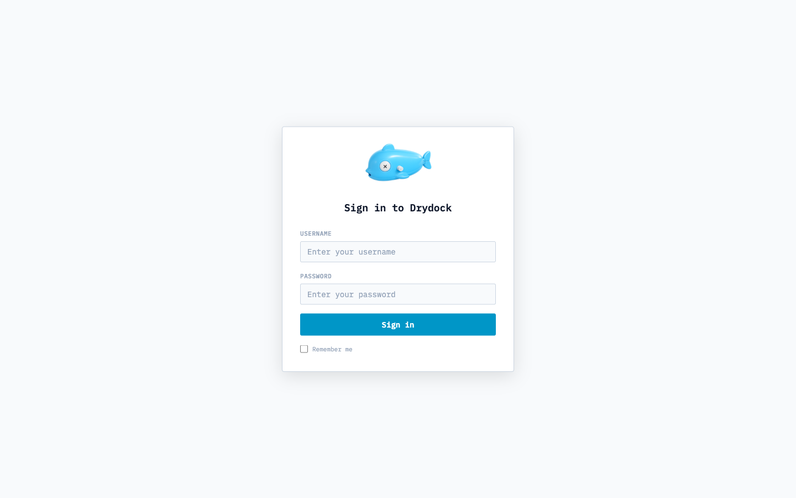</td>
<td>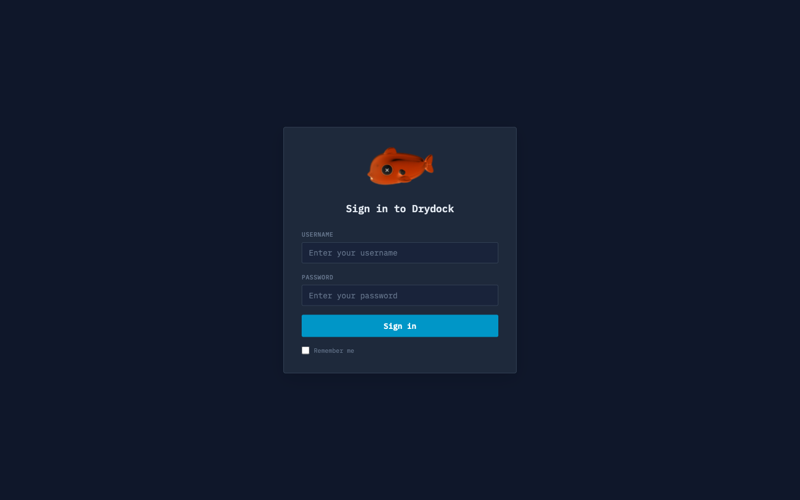</td>
</tr>
<tr>
<td>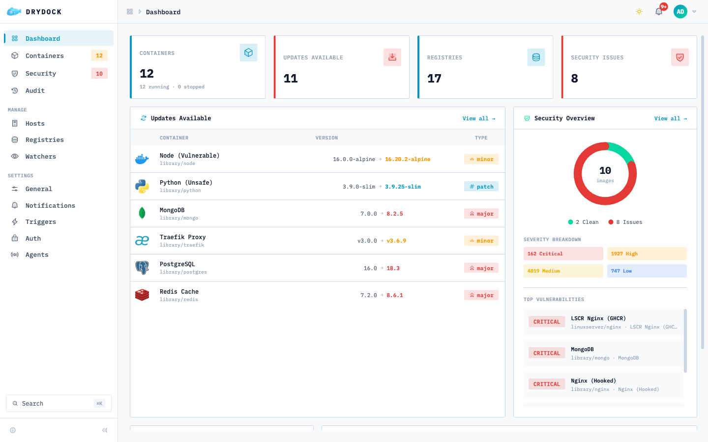</td>
<td>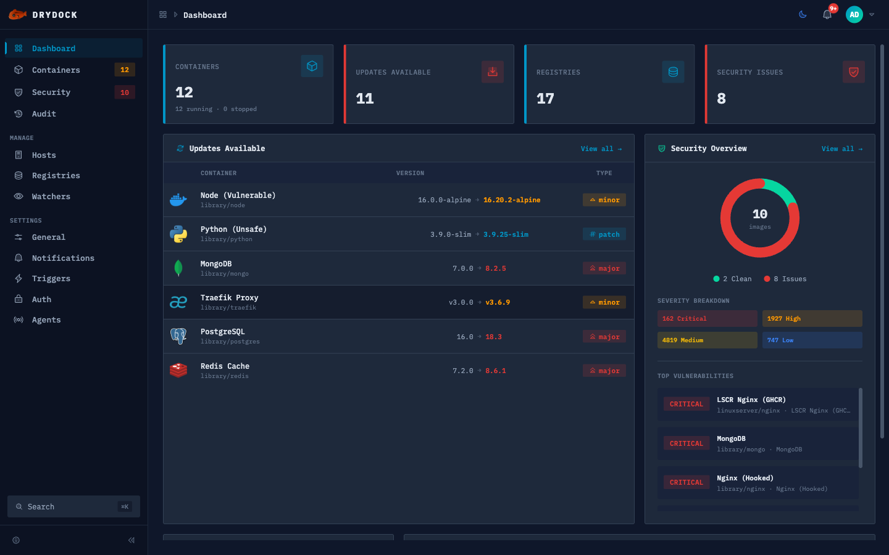</td>
</tr>
<tr>
<td>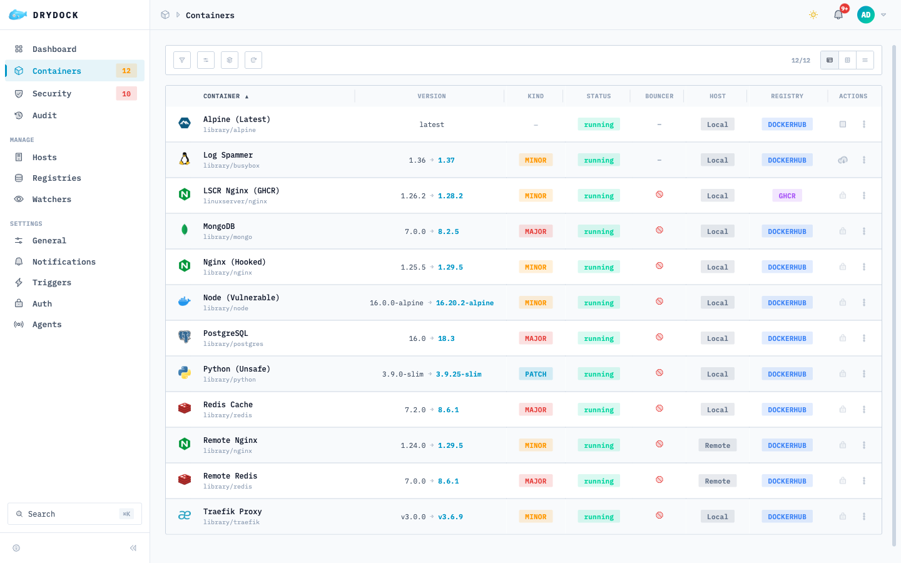</td>
<td>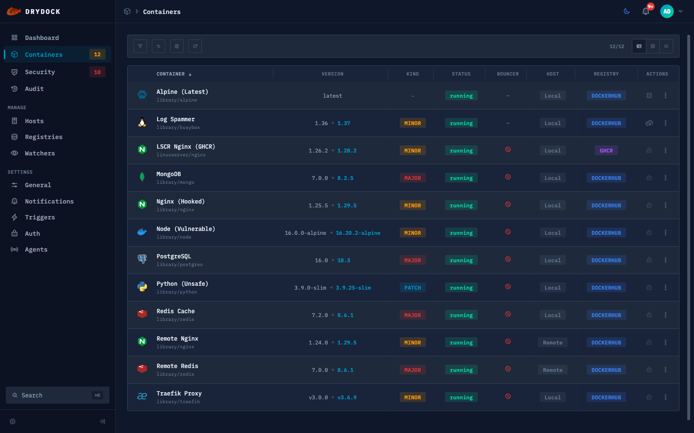</td>
</tr>
<tr>
<td>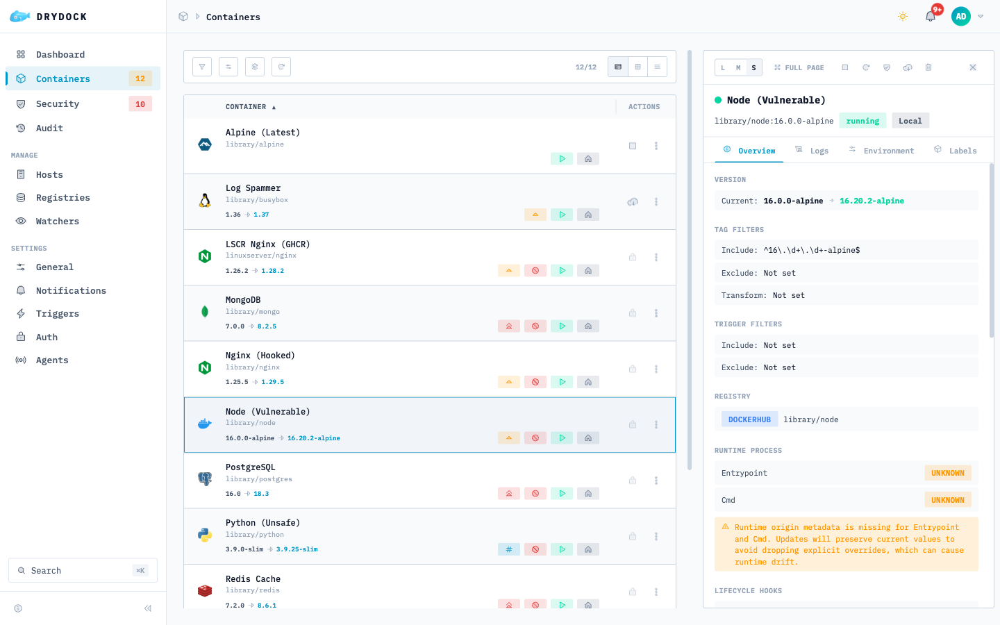</td>
<td>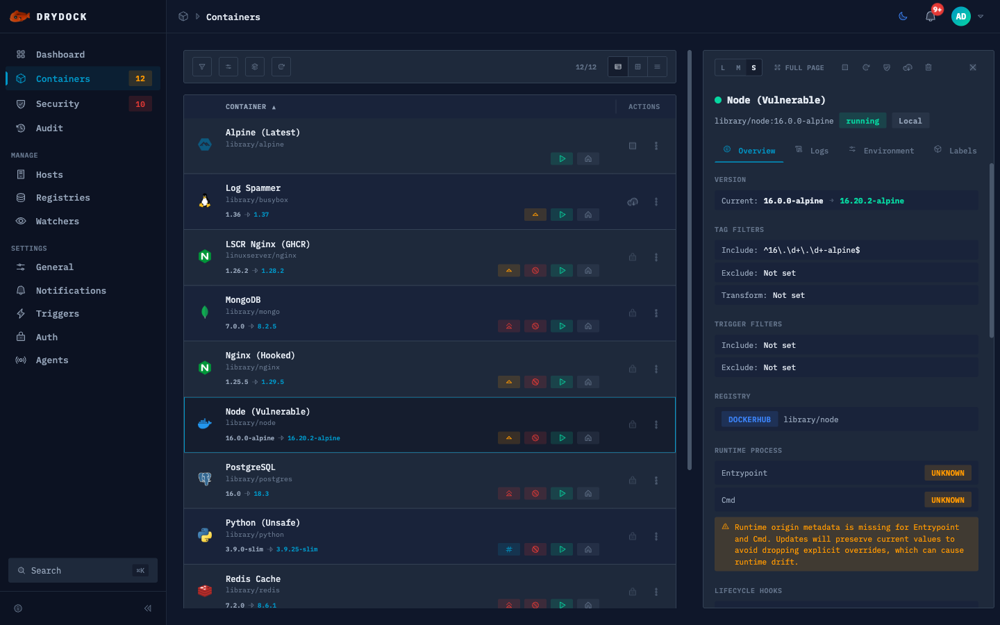</td>
</tr>
<tr>
<td align="center">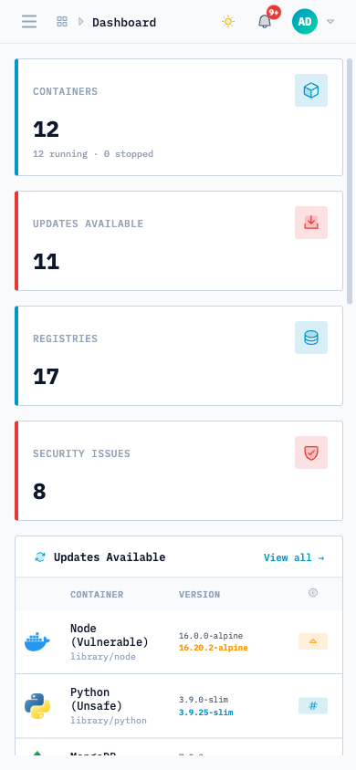</td>
<td align="center">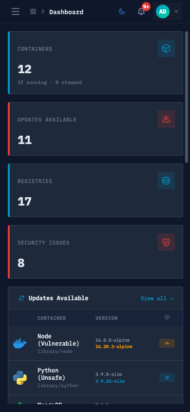</td>
</tr>
<tr>
<td align="center">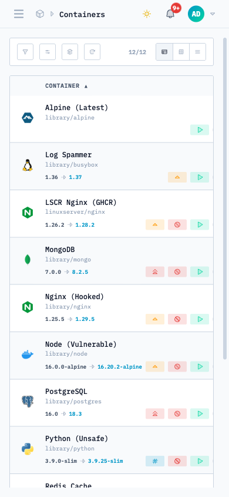</td>
<td align="center">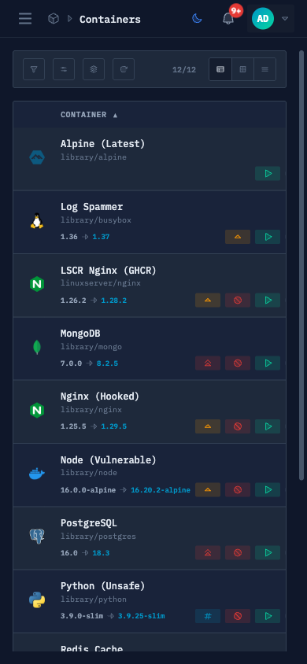</td>
</tr>
</table>

<br>

<h3 align="center" id="features">⚡ Features</h3>

---

Auto-detect running containers, check for image updates across 15 registry providers, and notify through 16 trigger channels — with a full web UI, REST API, and Prometheus metrics.

<details>
<summary><strong>All 18 features</strong></summary>

- **Container Monitoring** — Auto-detect running containers and check for image updates across registries
- **16 Notification Triggers** — Slack, Discord, Telegram, SMTP, MQTT, HTTP webhooks, Gotify, NTFY, and more
- **10+ Registry Providers** — Docker Hub, GHCR, ECR, GCR, GitLab, Quay, LSCR, Codeberg, DHI, and custom
- **Docker Compose Updates** — Auto-pull and recreate services via docker-compose with multi-network support
- **Distributed Agents** — Monitor remote Docker hosts with SSE-based agent architecture
- **Audit Log** — Event-based audit trail with persistent storage, REST API, and Prometheus counter
- **OIDC Authentication** — Authelia, Auth0, Authentik — secure your dashboard with OpenID Connect
- **Prometheus Metrics** — Built-in `/metrics` endpoint with optional auth bypass for monitoring stacks
- **Image Backup & Rollback** — Automatic pre-update image backup with configurable retention and one-click rollback
- **Container Actions** — Start, stop, restart, and update containers from the UI or API with feature-flag control
- **Webhook API** — Token-authenticated HTTP endpoints for CI/CD integration to trigger watch cycles and updates
- **Container Grouping** — Smart stack detection via compose project or labels with collapsible groups and batch-update
- **Lifecycle Hooks** — Pre/post-update shell commands via container labels with configurable timeout and abort control
- **Auto Rollback** — Automatic rollback on health check failure with configurable monitoring window and interval
- **Graceful Self-Update** — DVD-style animated overlay during drydock's own container update with auto-reconnect
- **Icon CDN** — Auto-resolved container icons via selfhst/icons with homarr-labs fallback
- **Mobile Responsive** — Fully responsive dashboard with optimized mobile breakpoints for all views
- **Multi-Registry Publishing** — Available on GHCR, Docker Hub, and Quay.io for flexible deployment

</details>

<br>

<h3 align="center" id="update-guard">🛡️ Update Guard</h3>

---

Trivy-powered safe-pull gate that scans candidate images for vulnerabilities, verifies signatures with cosign, and generates SBOMs — all before pulling or restarting. Disabled by default; enable with `DD_SECURITY_SCANNER=trivy`.

> **v1.3.0+:** The official image includes both `trivy` and `cosign` — no custom image required.

See the full configuration guide at [drydock.codeswhat.com/configuration/security](https://drydock.codeswhat.com/configuration/security).

<br>

<h3 align="center" id="supported-registries">📦 Supported Registries</h3>

---

<details>
<summary><strong>Public registries</strong> (auto-registered, no config needed)</summary>

| Registry | Provider | URL |
| --- | --- | --- |
| Docker Hub | `hub` | `hub.docker.com` |
| GitHub Container Registry | `ghcr` | `ghcr.io` |
| Google Container Registry | `gcr` | `gcr.io` |
| Quay | `quay` | `quay.io` |
| LinuxServer (LSCR) | `lscr` | `lscr.io` |
| DigitalOcean | `docr` | `registry.digitalocean.com` |
| Codeberg | `codeberg` | `codeberg.org` |
| DHI | `dhi` | `dhi.io` |
| Amazon ECR Public | `ecr` | `public.ecr.aws` |

</details>

<details>
<summary><strong>Private registries</strong> (require credentials)</summary>

| Registry | Provider | Env vars |
| --- | --- | --- |
| Docker Hub | `hub` | `DD_REGISTRY_HUB_{name}_LOGIN`, `_TOKEN` |
| Amazon ECR | `ecr` | `DD_REGISTRY_ECR_{name}_ACCESSKEYID`, `_SECRETACCESSKEY`, `_REGION` |
| Azure ACR | `acr` | `DD_REGISTRY_ACR_{name}_CLIENTID`, `_CLIENTSECRET` |
| GitLab | `gitlab` | `DD_REGISTRY_GITLAB_{name}_TOKEN` |
| GitHub (GHCR) | `ghcr` | `DD_REGISTRY_GHCR_{name}_TOKEN` |
| Gitea / Forgejo | `gitea` | `DD_REGISTRY_GITEA_{name}_LOGIN`, `_PASSWORD` |
| TrueForge | `trueforge` | `DD_REGISTRY_TRUEFORGE_{name}_NAMESPACE`, `_ACCOUNT`, `_TOKEN` |
| Custom (any v2) | `custom` | `DD_REGISTRY_CUSTOM_{name}_URL` + optional auth |

See [Registry docs](https://drydock.codeswhat.com/configuration/registries) for full configuration.

</details>

<br>

<h3 align="center" id="supported-triggers">🔔 Supported Triggers</h3>

---

<details>
<summary><strong>Notification triggers</strong> (16 providers)</summary>

All env vars use the `DD_` prefix; Docker labels use the `dd.` prefix.

| Trigger | Description | Docs |
| --- | --- | --- |
| Apprise | Universal notification gateway | [docs](https://drydock.codeswhat.com/configuration/triggers/apprise) |
| Command | Run arbitrary shell commands | [docs](https://drydock.codeswhat.com/configuration/triggers/command) |
| Discord | Discord webhook | [docs](https://drydock.codeswhat.com/configuration/triggers/discord) |
| Docker | Auto-pull and restart containers | [docs](https://drydock.codeswhat.com/configuration/triggers/docker) |
| Docker Compose | Auto-pull and recreate compose services | [docs](https://drydock.codeswhat.com/configuration/triggers/docker-compose) |
| Gotify | Gotify push notifications | [docs](https://drydock.codeswhat.com/configuration/triggers/gotify) |
| HTTP | Generic webhook (POST) | [docs](https://drydock.codeswhat.com/configuration/triggers/http) |
| IFTTT | IFTTT applet trigger | [docs](https://drydock.codeswhat.com/configuration/triggers/ifttt) |
| Kafka | Kafka message producer | [docs](https://drydock.codeswhat.com/configuration/triggers/kafka) |
| MQTT | MQTT message (Home Assistant compatible) | [docs](https://drydock.codeswhat.com/configuration/triggers/mqtt) |
| NTFY | ntfy.sh push notifications | [docs](https://drydock.codeswhat.com/configuration/triggers/ntfy) |
| Pushover | Pushover notifications | [docs](https://drydock.codeswhat.com/configuration/triggers/pushover) |
| Rocket.Chat | Rocket.Chat webhook | [docs](https://drydock.codeswhat.com/configuration/triggers/rocketchat) |
| Slack | Slack webhook | [docs](https://drydock.codeswhat.com/configuration/triggers/slack) |
| SMTP | Email notifications | [docs](https://drydock.codeswhat.com/configuration/triggers/smtp) |
| Telegram | Telegram bot messages | [docs](https://drydock.codeswhat.com/configuration/triggers/telegram) |

All triggers support **threshold filtering** (`all`, `major`, `minor`, `patch`) to control which updates fire notifications.

</details>

<br>

<h3 align="center" id="authentication">🔐 Authentication</h3>

---

<details>
<summary><strong>Supported auth methods</strong></summary>

| Method | Description | Docs |
| --- | --- | --- |
| Anonymous | No auth (default) | — |
| Basic | Username + password hash | [docs](https://drydock.codeswhat.com/configuration/authentications/basic) |
| OIDC | OpenID Connect (Authelia, Auth0, Authentik) | [docs](https://drydock.codeswhat.com/configuration/authentications/oidc) |

</details>

<br>

<h3 align="center" id="migrating-from-wud">🔄 Migrating from WUD</h3>

---

drydock is a drop-in replacement for What's Up Docker (WUD). Swap the image and restart — all `WUD_` env vars, `wud.*` labels, and state files are automatically migrated.

```diff
- image: getwud/wud:8.1.1
+ image: codeswhat/drydock:latest
```

<details>
<summary><strong>Migration details</strong></summary>

| WUD (legacy) | drydock (new) | Status |
| --- | --- | --- |
| `WUD_` env vars | `DD_` env vars | Both work — `WUD_` vars are automatically mapped to their `DD_` equivalents at startup. If both are set, `DD_` takes priority. |
| `wud.*` container labels | `dd.*` container labels | Both work — all `wud.*` labels are recognized alongside their `dd.*` counterparts. |
| `/store/wud.json` state file | `/store/dd.json` state file | Automatic migration — on first start, if `wud.json` exists and `dd.json` does not, drydock renames it in place. |
| Session store (connect-loki) | Session store (connect-loki) | Auto-healed — drydock automatically regenerates corrupt sessions from WUD migration. |

</details>

<details>
<summary><strong>Feature comparison</strong></summary>

> For the full itemized changelog, see [CHANGELOG.md](CHANGELOG.md).

<table>
<thead>
<tr>
<th width="24%">Feature</th>
<th width="13%" align="center">drydock</th>
<th width="13%" align="center">DockPeek</th>
<th width="13%" align="center">Watchtower</th>
<th width="13%" align="center">WUD</th>
<th width="12%" align="center">Diun</th>
<th width="12%" align="center">Ouroboros</th>
</tr>
</thead>
<tbody>
<tr><td>Web UI / Dashboard</td><td align="center">✅</td><td align="center">✅</td><td align="center">❌</td><td align="center">✅</td><td align="center">❌</td><td align="center">❌</td></tr>
<tr><td>Auto-update containers</td><td align="center">✅</td><td align="center">✅</td><td align="center">✅</td><td align="center">✅</td><td align="center">❌</td><td align="center">✅</td></tr>
<tr><td>Docker Compose updates</td><td align="center">✅</td><td align="center">❌</td><td align="center">⚠️</td><td align="center">✅</td><td align="center">❌</td><td align="center">❌</td></tr>
<tr><td>Notification triggers</td><td align="center">16</td><td align="center">❌</td><td align="center">~18 (Shoutrrr)</td><td align="center">14</td><td align="center">17</td><td align="center">~6</td></tr>
<tr><td>Registry providers</td><td align="center">15</td><td align="center">⚠️ (templates)</td><td align="center">⚠️ (Docker auth)</td><td align="center">8</td><td align="center">⚠️ (regopts)</td><td align="center">⚠️ (Docker auth)</td></tr>
<tr><td>OIDC / SSO authentication</td><td align="center">✅</td><td align="center">❌</td><td align="center">❌</td><td align="center">❌</td><td align="center">❌</td><td align="center">❌</td></tr>
<tr><td>REST API</td><td align="center">✅</td><td align="center">❌</td><td align="center">⚠️ (limited)</td><td align="center">✅</td><td align="center">⚠️ (gRPC)</td><td align="center">❌</td></tr>
<tr><td>Prometheus metrics</td><td align="center">✅</td><td align="center">❌</td><td align="center">✅</td><td align="center">✅</td><td align="center">❌</td><td align="center">✅</td></tr>
<tr><td>Image backup & rollback</td><td align="center">✅</td><td align="center">❌</td><td align="center">❌</td><td align="center">❌</td><td align="center">❌</td><td align="center">❌</td></tr>
<tr><td>Security scanning (Trivy)</td><td align="center">✅</td><td align="center">❌</td><td align="center">❌</td><td align="center">❌</td><td align="center">❌</td><td align="center">❌</td></tr>
<tr><td>Clickable port links</td><td align="center">❌</td><td align="center">✅</td><td align="center">❌</td><td align="center">❌</td><td align="center">❌</td><td align="center">❌</td></tr>
<tr><td>Traefik integration</td><td align="center">❌</td><td align="center">✅</td><td align="center">❌</td><td align="center">❌</td><td align="center">❌</td><td align="center">❌</td></tr>
<tr><td>Real-time log viewer</td><td align="center">✅</td><td align="center">✅</td><td align="center">❌</td><td align="center">❌</td><td align="center">❌</td><td align="center">❌</td></tr>
<tr><td>Image prune from UI</td><td align="center">❌</td><td align="center">✅</td><td align="center">❌</td><td align="center">❌</td><td align="center">❌</td><td align="center">❌</td></tr>
<tr><td>Docker Swarm support</td><td align="center">❌</td><td align="center">✅</td><td align="center">⚠️</td><td align="center">❌</td><td align="center">❌</td><td align="center">❌</td></tr>
<tr><td>JSON / CSV export</td><td align="center">❌</td><td align="center">✅</td><td align="center">❌</td><td align="center">❌</td><td align="center">❌</td><td align="center">❌</td></tr>
<tr><td>Container tagging / labels</td><td align="center">⚠️ (groups)</td><td align="center">✅</td><td align="center">❌</td><td align="center">❌</td><td align="center">❌</td><td align="center">❌</td></tr>
<tr><td>Dependent container recreation</td><td align="center">❌</td><td align="center">✅</td><td align="center">❌</td><td align="center">❌</td><td align="center">❌</td><td align="center">❌</td></tr>
<tr><td>Distributed agents</td><td align="center">✅</td><td align="center">⚠️ (multi-host)</td><td align="center">⚠️ (single host)</td><td align="center">❌</td><td align="center">✅ (multi-orch)</td><td align="center">❌</td></tr>
<tr><td>Actively maintained</td><td align="center">✅</td><td align="center">✅</td><td align="center">❌ (archived)</td><td align="center">✅</td><td align="center">✅</td><td align="center">❌ (dead)</td></tr>
</tbody>
</table>

> Data based on publicly available documentation as of February 2026.

</details>

<br>

<h3 align="center" id="roadmap">🗺️ Roadmap</h3>

---

| Version | Theme | Highlights |
| --- | --- | --- |
| **v1.3.x** ✅ | Security & Reliability | Trivy scanning, Update Guard, SBOM generation, image signing, on-demand scan, self-update fix, stale-digest fix, registry auth fixes, timeout hardening |
| **v1.4.0** | UI Modernization | PrimeVue migration, Composition API, Vite cleanup, font personalization, Docker event-stream resilience, HTTP auth schema, non-self-update rollback, UI timing guards |
| **v1.5.0** | Observability | Real-time log viewer, resource monitoring, registry webhooks, notification templates, release notes, MS Teams & Matrix |
| **v1.6.0** | Dashboard & UX | Clickable port links, Traefik label integration, image prune, JSON/CSV export, container tags, exit code explanations, drag-and-drop columns |
| **v1.7.0** | Fleet Management | YAML config, live UI config panels, volume browser, parallel updates, dependent container recreation, dependency ordering, SQLite store migration, backup retention policy |
| **v2.0.0** | Platform Expansion | Docker Swarm, Kubernetes watchers and triggers |
| **v2.1.0** | Deployment Patterns | Health check gates, canary deployments |
| **v2.2.0** | Container Operations | Web terminal, file browser, image building |
| **v2.3.0** | Developer Experience | API keys, passkey auth, TOTP 2FA, OpenAPI docs, TypeScript actions, CLI |
| **v2.4.0** | Data Safety | Scheduled backups (S3, SFTP), compose templates, secret management |
| **v3.0.0** | GitOps & Beyond | Git-based stack deployment, network topology, GPU monitoring, i18n |

<br>

<h3 align="center" id="documentation">📚 Documentation</h3>

---

| Resource | Link |
| --- | --- |
| Website & Docs | [drydock.codeswhat.com](https://drydock.codeswhat.com/) |
| Changelog | [`CHANGELOG.md`](CHANGELOG.md) |
| Issues & Discussions | [GitHub Issues](https://github.com/CodesWhat/drydock/issues) · [Discussions](https://github.com/CodesWhat/drydock/discussions) |

<br>

<h3 align="center" id="star-history">⭐ Star History</h3>

---

<div align="center">
  <a href="https://www.star-history.com/#CodesWhat/drydock&type=timeline&legend=top-left">
    <picture>
      <source media="(prefers-color-scheme: dark)" srcset="https://api.star-history.com/svg?repos=CodesWhat/drydock&type=timeline&theme=dark&legend=top-left" />
      <source media="(prefers-color-scheme: light)" srcset="https://api.star-history.com/svg?repos=CodesWhat/drydock&type=timeline&legend=top-left" />
      
    </picture>
  </a>
</div>

---

<div align="center">

[](https://semver.org/)
[](https://www.conventionalcommits.org/)
[](https://keepachangelog.com/)

### Built With

[](https://www.typescriptlang.org/)
[](https://vuejs.org/)
[](https://expressjs.com/)
[](https://vitest.dev/)
[](https://biomejs.dev/)
[](https://nodejs.org/)
[](https://www.docker.com/)
[](https://claude.ai/)

---

**[MIT License](LICENSE)**

<a href="https://github.com/CodesWhat"></a>

<a href="#drydock">Back to top</a>

</div>
