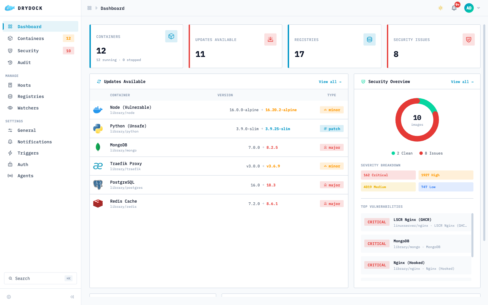
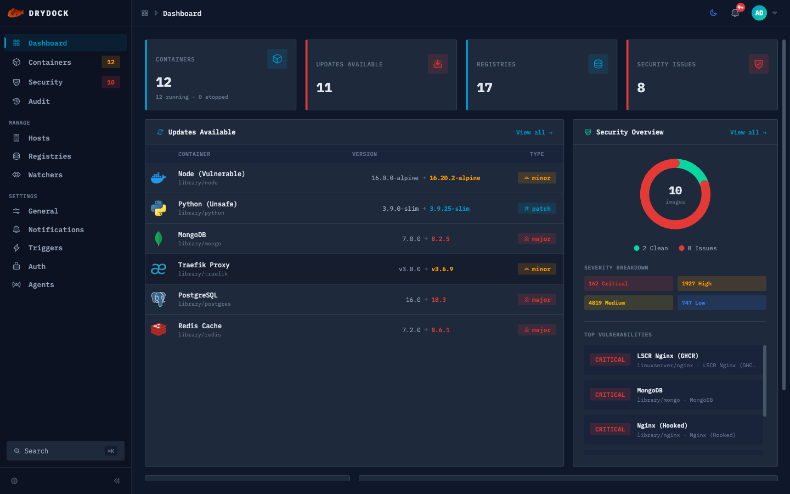

<div align="center">

<p><a href="README.md">English</a> · <a href="README.es.md">Español</a> · <a href="README.pl.md">Polski</a> · <strong>简体中文</strong> · <a href="README.de.md">Deutsch</a> · <a href="README.fr.md">Français</a> · <a href="README.pt-BR.md">Português (Brasil)</a></p>

<picture>
  <source media="(prefers-color-scheme: dark)" srcset="docs/assets/whale-logo-dark.png" />
  <source media="(prefers-color-scheme: light)" srcset="docs/assets/whale-logo.png" />
  
</picture>

<h1>drydock</h1>

**容器镜像更新观察程序，23 个注册表、21 个通知和操作提供程序。**

</div>

<p align="center"><a href="https://github.com/CodesWhat/drydock/releases"></a>
  <a href="https://github.com/orgs/CodesWhat/packages/container/package/drydock"></a>
  <a href="LICENSE"></a>
  <br>
  <a href="https://github.com/CodesWhat/drydock/actions/workflows/ci-verify.yml"></a>
  <a href="https://securityscorecards.dev/viewer/?uri=github.com/CodesWhat/drydock"></a>
  <a href="https://www.bestpractices.dev/projects/11915"></a>
  <a href="https://qlty.sh/gh/CodesWhat/projects/drydock"></a>
  <a href="https://dashboard.stryker-mutator.io/reports/github.com/CodesWhat/drydock/main"></a>
  <a href="https://codecov.io/gh/CodesWhat/drydock"></a>
  <br>
  <a href="https://hub.docker.com/r/codeswhat/drydock"></a>
  <a href="https://github.com/CodesWhat/drydock/stargazers"></a>
  <a href="https://github.com/veggiemonk/awesome-docker#container-management"></a>
  <a href="https://crowdin.com/project/drydock"></a>
  <a href="https://github.com/sponsors/CodesWhat"></a>
</p>

<hr>

> [!WARNING]
> **从旧版本更新？首先阅读升级说明。** 三个安全强化修复程序首先在 **1.4.6** 中发布，并贯穿整个 **1.5** 系列，因此从早于 1.4.6 的版本进行更新的任何人都会受到影响，无论他们登陆的是哪个版本（1.4.6、任何 1.5.x 或更高版本）。它们不是弃用，也没有宽限期：OIDC 现在要求您的提供商的发现元数据中包含 `authorization_endpoint`，TCP 对等地址上未经身份验证的速率限制密钥（反向代理后面的共享存储桶），并且 HTTP 触发代理 URL 必须使用 `http(s)://`。更新前请参阅 **[UPGRADE-NOTES.md](UPGRADE-NOTES.md)**。

<!-- separate alerts: a blank-line-only gap between blockquotes trips markdownlint MD028 -->

> [!WARNING]
> **正在升级到 1.6.0-rc.3 或更高版本？** 更多安全强化措施会立即生效，没有宽限期。未配置身份验证，或已启用但尚未确认匿名身份验证的实例，在升级后会像新安装一样以故障关闭方式运行：容器保持运行，受保护的 API 请求返回 `401`，公共身份验证发现和状态路由仍可访问，`/health` 返回 `503`。SPA 外壳仍可能加载，但无法读取受保护的数据。升级前请设置 `DD_ANONYMOUS_AUTH_CONFIRM=true`，或配置 `DD_AUTH_BASIC_*`/OIDC。会话 cookie 从 `connect.sid` 更名为 `drydock.sid`，因此所有现有用户会被注销一次。HTTP 通知触发器、Hass webhook 和注册表图标获取现在通过受保护的 DNS 查询解析主机名，阻止云元数据和 link-local 目标，并且绝不跟随重定向。仅在确实需要时为特定 `DD_NOTIFICATION_HTTP_*` 触发器设置 `allowmetadata=true`。完整迁移说明请参阅 **[DEPRECATIONS.md](DEPRECATIONS.md#enforced-security-changes-no-deprecation-window)**。

<h2 align="center">内容</h2>

- [文档](#documentation)
- [快速入门](#quick-start)
- [屏幕截图和现场演示](#screenshots)
- [为什么是 Drydock](#why-drydock)
- [特点](#features)
- [支持的集成](#supported-integrations)
- [功能比较](#feature-comparison)
- [迁移](#migration)
- [路线图](#roadmap)
- [星史](#star-history)
- [技术栈](#built-with)
- [社区与支持](#community-support)
- [CodesWhat 生态系统](#codeswhat-ecosystem)

<h2 align="center" id="documentation">文档</h2>

| 资源           | 链接                                                                                 |
| ------------ | ---------------------------------------------------------------------------------- |
| 网站           | [getdrydock.com](https://getdrydock.com/)                           |
| 现场演示         | [demo.getdrydock.com](https://demo.getdrydock.com) |
| 文档           | [getdrydock.com/docs](https://getdrydock.com/docs)                 |
| 配置           | [配置](https://getdrydock.com/docs/configuration)                                    |
| 快速入门         | [快速入门](https://getdrydock.com/docs/quickstart)                                     |
| 更新日志         | [`CHANGELOG.md`](CHANGELOG.md)                                                     |
| 弃用           | [`DEPRECATIONS.md`](DEPRECATIONS.md)                                               |
| 路线图          | 请参阅下面的[路线图](#roadmap) 部分                                                           |
| 贡献           | [`CONTRIBUTING.md`](CONTRIBUTING.md)                                               |
| 行为准则         | [`CODE_OF_CONDUCT.md`](CODE_OF_CONDUCT.md)                                         |
| 治理           | [`GOVERNANCE.md`](GOVERNANCE.md)                                                   |
| 安全保证         | [`SECURITY-ASSURANCE.md`](SECURITY-ASSURANCE.md)                                   |
| 安全政策         | [`SECURITY.md`](SECURITY.md)                                                       |
| 问题           | [GitHub 问题](https://github.com/CodesWhat/drydock/issues)                           |
| 讨论           | [GitHub 讨论](https://github.com/CodesWhat/drydock/discussions) — 欢迎功能请求和想法          |

<hr>

<h2 align="center" id="quick-start">快速入门</h2>

**推荐：使用套接字代理**来限制哪些 Docker API 端点 Drydock 可以访问。这可以避免容器完全访问 Docker 套接字。

> **注意：** Compose 会将 `$` 视为变量插值语法，因此粘贴单个 `$` 的 argon2id 哈希值到达 Drydock 时会被破坏。粘贴真实哈希值时，请将每个 `$` 替换为 `$$`，例如 `$$argon2id$$v=19$$m=65536,t=3,p=4$$salt$$hash`。

```yaml
services:
  drydock:
    image: codeswhat/drydock
    depends_on:
      socket-proxy:
        condition: service_healthy
    volumes:
      - drydock-store:/store
    environment:
      - DD_WATCHER_LOCAL_HOST=socket-proxy
      - DD_WATCHER_LOCAL_PORT=2375
      - DD_AUTH_BASIC_ADMIN_USER=admin
      - "DD_AUTH_BASIC_ADMIN_HASH=<paste-argon2id-hash>"
    ports:
      - 3000:3000

  socket-proxy:
    image: tecnativa/docker-socket-proxy
    volumes:
      - /var/run/docker.sock:/var/run/docker.sock
    environment:
      - CONTAINERS=1
      - IMAGES=1
      - EVENTS=1
      - SERVICES=1
      - INFO=1          # Required for daemon identity detection (notification prefixes)
      # Add POST=1 and NETWORKS=1 for container actions and auto-updates
    healthcheck:
      test: wget --spider http://localhost:2375/version || exit 1
      interval: 5s
      timeout: 3s
      retries: 3
      start_period: 5s
    restart: unless-stopped

volumes:
  drydock-store:
```

<details>
<summary>替代方案：<a href="https://github.com/CodesWhat/sockguard">sockguard</a>套接字代理</summary>

[sockguard](https://github.com/CodesWhat/sockguard) 是来自同一 CodesWhat 生态系统的默认拒绝 Docker 套接字过滤器，具有为 drydock 构建的预设：

> **注意：** Compose 会将 `$` 视为变量插值语法，因此粘贴单个 `$` 的 argon2id 哈希值到达 Drydock 时会被破坏。粘贴真实哈希值时，请将每个 `$` 替换为 `$$`，例如 `$$argon2id$$v=19$$m=65536,t=3,p=4$$salt$$hash`。

```yaml
services:
  drydock:
    image: codeswhat/drydock
    depends_on:
      sockguard:
        condition: service_healthy
    volumes:
      - drydock-store:/store
    environment:
      - DD_WATCHER_LOCAL_HOST=sockguard
      - DD_WATCHER_LOCAL_PORT=2375
      - DD_AUTH_BASIC_ADMIN_USER=admin
      - "DD_AUTH_BASIC_ADMIN_HASH=<paste-argon2id-hash>"
    ports:
      - 3000:3000

  sockguard:
    image: codeswhat/sockguard
    volumes:
      - /var/run/docker.sock:/var/run/docker.sock
      - ./sockguard.yaml:/etc/sockguard/config.yaml:ro
    environment:
      - SOCKGUARD_CONFIG_FILE=/etc/sockguard/config.yaml
    healthcheck:
      test: wget --spider http://localhost:2375/version || exit 1
      interval: 5s
      timeout: 3s
      retries: 3
      start_period: 5s
    restart: unless-stopped

volumes:
  drydock-store:
```

请参阅 sockguard 的 [`app/configs/portwing.yaml`](https://github.com/CodesWhat/sockguard/blob/dev/v1.5/app/configs/portwing.yaml) 预设，了解起始 `sockguard.yaml`（相同的预设 portwing 在其自己的示例中提供）。

</details>

<details>
<summary>替代方案：通过直接挂载套接字快速启动</summary>

```bash
docker run -d \
  --name drydock \
  -p 3000:3000 \
  -v /var/run/docker.sock:/var/run/docker.sock \
  -v drydock-store:/store \
  -e DD_AUTH_BASIC_ADMIN_USER=admin \
  -e 'DD_AUTH_BASIC_ADMIN_HASH=<paste-argon2id-hash>' \
  codeswhat/drydock:latest
```

> **警告：** 直接套接字访问授予容器对 Docker 守护进程的完全控制权。使用上面的套接字代理设置进行生产部署。请参阅 [Docker Socket 安全指南](https://getdrydock.com/docs/configuration/watchers#docker-socket-security) 了解所有选项，包括远程 TLS 和 rootless Docker。
>
> 请按示例使用单引号包裹哈希值。双引号仍会让 shell 在 docker 看到之前展开 `$`，从而破坏真实的 argon2id 哈希值。

</details>

> 生成密码哈希（`argon2` CLI — 通过包管理器安装）：
>
> ```bash
> echo -n "yourpassword" | argon2 $(openssl rand -base64 32) -id -m 16 -t 3 -p 4 -l 64 -e
> ```
>
> 或者使用 Node.js 24.7+（不需要额外的包）：
>
> ```bash
> node -e 'const c=require("node:crypto");const s=c.randomBytes(32);const h=c.argon2Sync("argon2id",{message:process.argv[1],nonce:s,memory:65536,passes:3,parallelism:4,tagLength:64});console.log("argon2id$65536$3$4$"+s.toString("base64")+"$"+h.toString("base64"));' "yourpassword"
> ```
>
> Drydock v1.6 仅接受 argon2id 基本身份验证哈希值。旧版 `{SHA}`、`$apr1$`/`$1$`、`crypt` 和纯文本哈希被拒绝；在升级之前重新生成它们。
> **默认情况下需要身份验证**。有关 OIDC、匿名访问和其他选项，请参阅 [auth docs](https://getdrydock.com/docs/configuration/authentications)。
> 新安装和升级后的实例都必须通过 `DD_ANONYMOUS_AUTH_CONFIRM=true` 明确确认匿名访问。若未确认，无论是未配置身份验证还是匿名身份验证尚未确认，实例都会以故障关闭模式启动：受保护的 API 请求返回 `401`，公共身份验证发现和状态路由仍可用，`/health` 返回 `503`。

该镜像包含`trivy`和`cosign`二进制文件，用于本地漏洞扫描和镜像验证。

有关 Docker Compose、套接字安全、反向代理和替代注册表，请参阅[快速入门指南](https://getdrydock.com/docs/quickstart)。

每个版本的变更内容见 [`CHANGELOG.md`](CHANGELOG.md) 和 [GitHub Releases](https://github.com/CodesWhat/drydock/releases) 页面。

<hr>

<h2 align="center" id="screenshots">屏幕截图和现场演示</h2>

<p align="center">
  
</p>

<p align="center"><em>发现更新，查看到底发生了什么变化，然后应用它。处理备份、健康检查和回滚。</em></p>

<table>
<tbody><tr>
<td width="50%" align="center"><strong>光</strong></td>
<td width="50%" align="center"><strong>黑暗</strong></td>
</tr>
<tr>
<td></td>
<td></td>
</tr>
</tbody></table>

<div align="center">

**既然可以亲自体验，为什么还要看截图呢？**

<a href="https://demo.getdrydock.com"></a>

完全交互——真实的用户界面，模拟数据，无需安装。完全在浏览器中运行。

</div>

<hr>

<h2 align="center" id="why-drydock">为什么是Drydock</h2>

容器镜像悄然过时。基础镜像修补 CVE、应用程序剪切版本、标签移动。除非您手动监视每个注册表，否则正在运行的容器会落后，直到出现问题或被利用。

大多数工具都会迫使人们做出权衡。自动更新程序（Watchtower、Ouroboros）在几乎没有可见性或控制的情况下拉取并重新启动，并且现在基本上不再维护。仪表板 (Portainer) 管理容器，但不是为更新智能而构建的。 Drydock 是**监控优先**：它会监控 23 个注册表，并在发生任何事情之前准确地告诉您发生了什么变化（主要、次要、补丁或摘要），然后仅在您允许时才采取行动。它比他们中的任何一个都走得更远。 Trivy/Grype 漏洞扫描阻止不安全更新，Cosign 验证签名，更新前映像备份在运行状况检查失败时自动回滚，分布式代理覆盖远程主机，21 个通知和操作集成形成闭环。完整的更新生命周期，带有 Web UI 和 REST API。

<hr>

<h2 align="center" id="features">特点</h2>

| |特色|描述 |
| --- | ---------------------- | ------------------------------------------------------------------------------------------------------------------------------------------------------------------------------------------------------------------------------------------------------------------------------------------------------------------------------------------------------------------------------------------------------------------------------------------------------------------------------------------------------------------ |
| 🔭  | **监控优先检测**             | 监视每个正在运行的容器，并在发生任何情况之前将每个可用更新分类为主要、次要、补丁或摘要。除非你这么说，否则一切都不会改变。                                                                                                                                                                                                                                                                                                                                                                                                                                     |
| 📦  | **23 家注册提供商**          | Docker Hub、GHCR、ECR、ACR、GCR、GAR、GitLab、Quay、Harbor、Artifactory、Nexus 等 12 个。公共和私有、云和自托管，具有每个注册表 TLS 和身份验证。                                                                                                                                                                                                                                                                                                                                                      |
| 🔔  | **21 个触发器**            | 17 个通知通道（Slack、Discord、Telegram、Teams、SMTP、MQTT、ntfy 等）以及 Docker、Docker Compose、Portainer 和命令操作，具有每个事件/提供商模板、实时预览、阈值过滤和批处理模式。                                                                                                                                                                                                                                                                                                                                                                                                |
| 🥊  | **Update Bouncer**     | Trivy/Grype 漏洞扫描可在部署之前阻止不安全的更新，并具有 Cosign 签名验证和 SBOM 生成功能（CycloneDX 和 SPDX）。                                                                                                                                                                                                                                                                                                                                                                                                                                          |
| ↩️  | **镜像备份和自动回滚**          | 预更新映像快照，具有可配置的保留、运行状况检查失败时自动回滚以及从 UI 中一键手动回滚。                                                                                                                                                                                                                                                                                                                                                                                                                                                                      |
| 🪝  | **生命周期挂钩**             | 通过容器标签执行更新前和更新后的 shell 命令，并具有每个钩子超时和失败时中止控制。                                                                                                                                                                                                                                                                                                                                                                                                                                                                       |
| 🗂️ | **Docker Compose 更新**  | 通过 Docker Engine API 以及保留 YAML 的映像修补来拉取并重新创建 Compose 服务。                                                                                                                                                                                                                                                                                                                                                                                                                                                           |
| 🎛️ | **每个容器的政策**            | 正则表达式标签规则和触发路由使用`dd.*`标签；成熟度门、跳过/暂停/固定和维护窗口通过 UI/API 或观察者配置存储。                                                                                                                                                                                                                                                                                                                                                                                                                                                     |
| 🛰️ | **分布式代理**              | 通过 SSE 监控远程 Docker 主机。Portwing 0.9.0+ 代理可以使用入站 Standard HTTP 或出站 Edge WebSocket 传输；Drydock 1.6.0-rc.11+ 可通过任一经过身份验证的路径在控制器端执行原生注册表检查以及单个或批量 Docker 更新。Edge 还可连续传输实时日志而无需入站端口；`DD_EXPERIMENTAL_PORTWING=false` 仍是紧急禁用开关。                                                                                                                                                                                                                |
| 🖥️ | **网络仪表板**              | Vue 3 UI 具有零依赖可定制小部件网格、响应式表格/卡片视图、实时 SSE 更新、通知铃控件以及每个容器的详细信息、日志和统计信息。                                                                                                                                                                                                                                                                                                                                                                                                                                              |
| 🔗  | **REST API 和 Webhook** | 用于 CI/CD 监视和更新触发器的令牌身份验证端点，以及用于推送事件的签名注册表 Webhook 摄取。                                                                                                                                                                                                                                                                                                                                                                                                                                                              |
| 🔐  | **OIDC 身份验证**          | 使用 OpenID Connect（Authelia、Auth0、Authentik）保护仪表板。默认情况下，任何身份验证流程发生故障时都会拒绝访问（fail-closed）。                                                                                                                                                                                                                                                                                                                                                                                                       |
| 📈  | **Prometheus 指标**      | 内置 `/metrics` 端点，具有适用于 Prometheus 和 Grafana 监控堆栈的可选身份验证旁路。                                                                                                                                                                                                                                                                                                                                                                                                                                                         |
| 🌍  | **17 个 UI 语言环境**       | 完整的翻译系统，英语内容完整，并有 16 个由社区维护的语言环境通过 Crowdin 同步，可在配置中切换。                                                                                                                                                                                                                                                                                                                                                                                                                                                       |
| 🔒  | **ReDoS-免疫正则表达式**      | 每个用户提供的标签模式都通过 re2js（纯 JS RE2 端口）进行编译，以实现线性时间匹配，不会因灾难性回溯模式而停止。                                                                                                                                                                                                                                                                                                                                                                                                                                                     |

<hr>

<h2 align="center" id="supported-integrations">支持的集成</h2>

### 注册表 (23)

Docker Hub · GHCR · ECR · ACR · GCR · GAR · GitLab · Quay · LSCR · Harbor · Artifactory · Nexus · Gitea · Forgejo · Codeberg · MAU · TrueForge · Custom · DOCR · DHI · IBM Cloud · Oracle Cloud · 阿里云

### 行动 (4)

Docker·Docker Compose·Portainer·Command

### 通知 (17)

Apprise · Discord · Google Chat · Gotify · HTTP · IFTTT · Kafka · Matrix · Mattermost · MQTT · MS Teams · NTFY · Pushover · Rocket.Chat · Slack · SMTP · Telegram

### 身份验证

匿名（通过 `DD_ANONYMOUS_AUTH_CONFIRM=true` 选择加入） · 基本（用户名 + 密码哈希） · OIDC（Authelia、Auth0、Authentik）。默认情况下，任何身份验证流程发生故障时都会拒绝访问（fail-closed）。

### Update Bouncer

Trivy 或 Grype 支持的漏洞扫描会在部署之前阻止不安全的更新。包括 Cosign 签名验证和 SBOM 生成（CycloneDX 和 SPDX）。

<hr>

<h2 align="center" id="feature-comparison">功能比较</h2>

<details>
<summary><strong>drydock 与其他容器更新工具相比如何？</strong></summary>

> ✅ = 支持 &nbsp; ❌ = 不支持 &nbsp; ⚠️ = 部分/有限 &nbsp; ? = 未确认 &nbsp; † = 已存档，不再维护

<h4 align="center">更新管理器</h4>

<table>
<thead>
<tr>
<th width="32%">功能</th>
<th width="17%" align="center">drydock</th>
<th width="17%" align="center">WUD</th>
<th width="17%" align="center">Diun</th>
<th width="17%" align="center"><em>Watchtower&nbsp;†</em></th>
</tr>
</thead>
<tbody>
<tr><td>积极维护</td><td align="center">✅</td><td align="center">✅</td><td align="center">✅</td><td align="center">❌</td></tr>
<tr><td>Web 界面 / 仪表盘</td><td align="center">✅</td><td align="center">✅</td><td align="center">❌</td><td align="center">❌</td></tr>
<tr><td>自动更新容器</td><td align="center">✅</td><td align="center">✅</td><td align="center">❌</td><td align="center">✅</td></tr>
<tr><td>Docker Compose 更新</td><td align="center">✅</td><td align="center">✅</td><td align="center">❌</td><td align="center">⚠️</td></tr>
<tr><td>支持 SemVer 的更新</td><td align="center">✅</td><td align="center">✅</td><td align="center">⚠️</td><td align="center">❌</td></tr>
<tr><td>镜像摘要监控</td><td align="center">✅</td><td align="center">✅</td><td align="center">✅</td><td align="center">✅</td></tr>
<tr><td>更新阈值过滤（major/minor/patch/digest）</td><td align="center">✅</td><td align="center">✅</td><td align="center">❌</td><td align="center">❌</td></tr>
<tr><td>依赖感知的更新排序</td><td align="center">⚠️</td><td align="center">❌</td><td align="center">❌</td><td align="center">❌</td></tr>
<tr><td>待审批队列</td><td align="center">⚠️</td><td align="center">❌</td><td align="center">❌</td><td align="center">❌</td></tr>
<tr><td>镜像备份与回滚</td><td align="center">✅</td><td align="center">❌</td><td align="center">❌</td><td align="center">❌</td></tr>
<tr><td>生命周期钩子（更新前/后）</td><td align="center">✅</td><td align="center">❌</td><td align="center">❌</td><td align="center">✅</td></tr>
<tr><td>漏洞扫描</td><td align="center">✅</td><td align="center">❌</td><td align="center">❌</td><td align="center">❌</td></tr>
<tr><td>审计日志</td><td align="center">✅</td><td align="center">❌</td><td align="center">❌</td><td align="center">❌</td></tr>
<tr><td>RBAC / 多用户角色</td><td align="center">❌</td><td align="center">❌</td><td align="center">❌</td><td align="center">❌</td></tr>
<tr><td>OIDC / SSO 身份验证</td><td align="center">✅</td><td align="center">✅</td><td align="center">❌</td><td align="center">❌</td></tr>
<tr><td>触发器 / 通知渠道</td><td align="center">21</td><td align="center">17</td><td align="center">17</td><td align="center">~20</td></tr>
<tr><td>MQTT / Home Assistant</td><td align="center">✅</td><td align="center">✅</td><td align="center">⚠️</td><td align="center">❌</td></tr>
<tr><td>镜像仓库提供商</td><td align="center">23</td><td align="center">12</td><td align="center">⚠️</td><td align="center">⚠️</td></tr>
<tr><td>REST API</td><td align="center">✅</td><td align="center">✅</td><td align="center">⚠️</td><td align="center">⚠️</td></tr>
<tr><td>用于 CI/CD 的 Webhook API</td><td align="center">✅</td><td align="center">❌</td><td align="center">❌</td><td align="center">✅</td></tr>
<tr><td>Prometheus 指标</td><td align="center">✅</td><td align="center">✅</td><td align="center">✅</td><td align="center">✅</td></tr>
<tr><td>分布式代理（远程）</td><td align="center">✅</td><td align="center">⚠️</td><td align="center">❌</td><td align="center">⚠️</td></tr>
<tr><td>容器分组 / 堆栈</td><td align="center">✅</td><td align="center">✅</td><td align="center">❌</td><td align="center">❌</td></tr>
<tr><td>启动/停止/重启/更新容器</td><td align="center">✅</td><td align="center">❌</td><td align="center">❌</td><td align="center">❌</td></tr>
<tr><td>容器日志查看器</td><td align="center">✅</td><td align="center">❌</td><td align="center">❌</td><td align="center">❌</td></tr>
</tbody>
</table>

> Watchtower 已于 2025 年 12 月存档，最后一个版本是 v1.7.1（2023 年 11 月）。非官方社区分支 nicholas-fedor/watchtower 仍在持续发布。

<h4 align="center">管理平台</h4>

<table>
<thead>
<tr>
<th width="32%">功能</th>
<th width="17%" align="center">drydock</th>
<th width="17%" align="center">Arcane</th>
<th width="17%" align="center">Komodo</th>
<th width="17%" align="center">Dockhand</th>
</tr>
</thead>
<tbody>
<tr><td>积极维护</td><td align="center">✅</td><td align="center">✅</td><td align="center">✅</td><td align="center">✅</td></tr>
<tr><td>Web 界面 / 仪表盘</td><td align="center">✅</td><td align="center">✅</td><td align="center">✅</td><td align="center">✅</td></tr>
<tr><td>自动更新容器</td><td align="center">✅</td><td align="center">✅</td><td align="center">✅</td><td align="center">✅</td></tr>
<tr><td>Docker Compose 更新</td><td align="center">✅</td><td align="center">✅</td><td align="center">✅</td><td align="center">✅</td></tr>
<tr><td>支持 SemVer 的更新</td><td align="center">✅</td><td align="center">❌</td><td align="center">❌</td><td align="center">✅</td></tr>
<tr><td>镜像摘要监控</td><td align="center">✅</td><td align="center">✅</td><td align="center">✅</td><td align="center">✅</td></tr>
<tr><td>更新阈值过滤（major/minor/patch/digest）</td><td align="center">✅</td><td align="center">❌</td><td align="center">⚠️</td><td align="center">⚠️</td></tr>
<tr><td>依赖感知的更新排序</td><td align="center">⚠️</td><td align="center">✅</td><td align="center">✅</td><td align="center">?</td></tr>
<tr><td>待审批队列</td><td align="center">⚠️</td><td align="center">❌</td><td align="center">❌</td><td align="center">❌</td></tr>
<tr><td>镜像备份与回滚</td><td align="center">✅</td><td align="center">❌</td><td align="center">❌</td><td align="center">❌</td></tr>
<tr><td>漏洞扫描</td><td align="center">✅</td><td align="center">✅</td><td align="center">❌</td><td align="center">✅</td></tr>
<tr><td>审计日志</td><td align="center">✅</td><td align="center">✅</td><td align="center">✅</td><td align="center">⚠️</td></tr>
<tr><td>RBAC / 多用户角色</td><td align="center">❌</td><td align="center">✅</td><td align="center">✅</td><td align="center">⚠️</td></tr>
<tr><td>OIDC / SSO 身份验证</td><td align="center">✅</td><td align="center">✅</td><td align="center">✅</td><td align="center">✅</td></tr>
<tr><td>触发器 / 通知渠道</td><td align="center">21</td><td align="center">11+</td><td align="center">5</td><td align="center">15+</td></tr>
<tr><td>MQTT / Home Assistant</td><td align="center">✅</td><td align="center">❌</td><td align="center">❌</td><td align="center">✅</td></tr>
<tr><td>镜像仓库提供商</td><td align="center">23</td><td align="center">⚠️</td><td align="center">⚠️</td><td align="center">⚠️</td></tr>
<tr><td>Prometheus 指标</td><td align="center">✅</td><td align="center">❌</td><td align="center">❌</td><td align="center">✅</td></tr>
<tr><td>分布式代理（远程）</td><td align="center">✅</td><td align="center">✅</td><td align="center">✅</td><td align="center">✅</td></tr>
<tr><td>容器分组 / 堆栈</td><td align="center">✅</td><td align="center">✅</td><td align="center">✅</td><td align="center">?</td></tr>
</tbody>
</table>

> 数据整理自各项目的公开文档与代码仓库，截至 2026 年 8 月 29 日。
> 如果有任何信息不准确，欢迎贡献。

</details>

<hr>

<h2 align="center" id="migration">迁移</h2>

<details>
<summary><strong>从 WUD 迁移（Docker 怎么样？）</strong></summary>

Drydock v1.6 不再在运行时加载 `WUD_*` 环境变量或 `wud.*` 标签。在启动升级服务之前重写它们；持久状态仍然会自动迁移。使用`docker exec -it drydock node dist/index.js config migrate --dry-run`进行预览，然后使用`docker exec -it drydock node dist/index.js config migrate --file .env --file compose.yaml`将配置重写为`DD_*`和`dd.*`命名。

</details>

<hr>

<h2 align="center" id="roadmap">路线图</h2>

<details>
<summary><strong>版本主题及亮点</strong></summary>

此方向至少覆盖未来十二个月，直至 2027 年 8 月。
此处仅列出高级主题；各版本详情请参阅 [CHANGELOG.md](CHANGELOG.md)。

| 版本                                           | 主题           | 亮点                                                                                                                                                                                                                                                                                                                                                                                                                                                                                                                                                                                                                                                                                                                                                                                                                                                                                                                                                                                                                                                                                                                                                |
| -------------------------------------------- | ------------ | ------------------------------------------------------------------------------------------------------------------------------------------------------------------------------------------------------------------------------------------------------------------------------------------------------------------------------------------------------------------------------------------------------------------------------------------------------------------------------------------------------------------------------------------------------------------------------------------------------------------------------------------------------------------------------------------------------------------------------------------------------------------------------------------------------------------------------------------------------------------------------------------------------------------------------------------------------------------------------------------------------------------------------------------------------------------------------------------------------------------------------------------------- |
| **v1.3.x** ✅ | 安全稳定         | Trivy 扫描、Update Bouncer、SBOM、7 个新注册表、4 个新触发器、re2js 正则表达式引擎                                                                                                                                                                                                                                                                                                                                                                                                                                                                                                                                                                                                                                                                                                                                                                                                                                                                                                                                                                                                                                                                                        |
| **v1.4.x** ✅ | UI 现代化和强化    | Tailwind 4 + 自定义组件、6 个主题、Cmd/K 调色板、OpenAPI 3.1、撰写原生 YAML 更新、双槽扫描、OIDC 强化                                                                                                                                                                                                                                                                                                                                                                                                                                                                                                                                                                                                                                                                                                                                                                                                                                                                                                                                                                                                                                                          |
| **v1.5.0** ✅ | 可观察性和 i18n   | 触发分类拆分 (`DD_ACTION_*`/`DD_NOTIFICATION_*`)、WebSocket 日志查看器、仪表板自定义、资源监控、通知发件箱 + DLQ、安全扫描摘要、17 个区域设置、SSE 最后事件 ID 重播、使用 Ed25519 身份验证的边缘代理拨出（实验性、`DD_EXPERIMENTAL_PORTWING=true`）                                                                                                                                                                                                                                                                                                                                                                                                                                                                                                                                                                                                                                                                                                                                                                                                                                                                                                                                                  |
| **v1.5.1** ✅ | 安全与维护        | GCR/GAR pull-auth 修复、注册表 TLS 完成 (M-2)、hook env-var 注入强化、`DD_SESSION_SECRET__FILE` 支持、调试转储凭据编辑、机密文件权限检查、成熟度门死锁修复、完整 UI 可翻译性 + 社区翻译、维护窗口自动应用门、容器正常运行时间显示、标签/版本列分割显示软件版本（OCI 标签，带有 `dd.inspect.tag.path`双写 + 选择加入 `dd.inspect.tag.version-only` 路由），选择加入 compose 挂载前缀匹配，`${currentReleaseNotes}` 模板变量                                                                                                                                                                                                                                                                                                                                                                                                                                                                                                                                                                                                                                                                                                                                                                                                                             |
| **v1.5.2** ✅ | 政策和固定标签可靠性   | 娱乐安全成熟度/跳过/暂停策略保留、固定标签摘要重建检测和信息同族洞察、回滚候选清理、回滚级联预防、显式 MAC 保存和本地映像注册表跳过行为                                                                                                                                                                                                                                                                                                                                                                                                                                                                                                                                                                                                                                                                                                                                                                                                                                                                                                                                                                                                                                                                           |
| **v1.6.0**   | 通知、策略与发布情报 | 每规则/每触发器通知模板，具有实时预览、通知铃声首选项、跨设备首选项同步、零依赖自定义仪表板网格 ([#281](https://github.com/CodesWhat/drydock/issues/281))、声明性更新策略 ([#320](https://github.com/CodesWhat/drydock/issues/320))、成熟稳定倒计时 + 即时候选人可见性 + 手动覆盖 ([#406](https://github.com/CodesWhat/drydock/discussions/406))、可操作更新状态面板和全局`notify` / `manual` / `auto` 更新模式 ([#325](https://github.com/CodesWhat/drydock/discussions/325))、观察者/imgset/容器标签策略继承以及堆叠当前 → 较新的固定标签可见性 ([#498](https://github.com/CodesWhat/drydock/issues/498))、标准化 44px 跨表、卡片和详细信息的源/发行说明/注册表资源操作([#295](https://github.com/CodesWhat/drydock/discussions/295))、运行状况事件通知 ([#198](https://github.com/CodesWhat/drydock/discussions/198))、双向 Home Assistant MQTT、响应式表/卡列表视图、通过命令或固定 Docker-worker 后端执行 Trivy、Grype 或两者扫描、扫描器资产拉取/热控制、堆外重复数据删除SBOM 存储、Trivy 长扫描正确性 ([#490](https://github.com/CodesWhat/drydock/issues/490))、触发分类迁移警告、v1.6 兼容性删除、文档/API 卫生以及 `/api` → `/api/v1` 迁移完成，并选择加入 wud-card/Homepage 兼容性填充程序 (`DD_COMPAT_WUDCARD`)。 |
| **v1.7.0** | 智能更新和用户体验 | 依赖感知的更新排序（[#219](https://github.com/CodesWhat/drydock/discussions/219)）、每次操作更新策略（[#511](https://github.com/CodesWhat/drydock/discussions/511)）、统一的成熟度/更新时间时钟、可点击端口链接、键盘快捷键、PWA、深色主题对比度改进（WCAG 2.2）（[#850](https://github.com/CodesWhat/drydock/issues/850)、[#865](https://github.com/CodesWhat/drydock/discussions/865)）、`DD_TRIGGER_*` 删除（v1.5.0 弃用窗口结束）、从镜像中删除了 curl |
| **v1.8.0** | 集群管理与实时配置 | **已合入 `dev/v1.8`，尚未发布：** SQLite 存储、审批队列、YAML 配置、限定范围的监视器/通知/操作策略编辑器及安全摘要模板、并行更新、选择性批量更新（[#232](https://github.com/CodesWhat/drydock/discussions/232)）、依赖顺序界面、镜像清单与清理、集群健康状态与清单刷新、可分享的标签分组、 仅用于通知的精确分组路由 ([#1251](https://github.com/CodesWhat/drydock/pull/1251))、仅限制安装的维护窗口 ([#946](https://github.com/CodesWhat/drydock/discussions/946))、第一方身份验证、限定范围的 API 密钥 ([#469](https://github.com/CodesWhat/drydock/discussions/469))，以及 Home Assistant 更新进度与设备 ([#210](https://github.com/CodesWhat/drydock/discussions/210))。**待完成：** 更广泛的实时配置以及分组和操作的继承策略仍需确定设置归属；TOTP 需要批准实施方案；静态镜像列表监视器暂缓至 GA 之后。 |
| **v2.0+** | 平台扩展及其他 | Swarm/Kubernetes 观察者、GitOps 同步、卷浏览器、根据声明的上游基础监控本地构建的镜像（[#897](https://github.com/CodesWhat/drydock/discussions/897)）、健康门、金丝雀部署、Web 终端、RBAC、LDAP/AD、通过其 Docker 兼容 API 提供的基础 Podman 支持、CLI、Wolfi 强化映像、套接字代理 |

**尚未完成的社区需求：** 跨主机依赖更新和重启（[#219](https://github.com/CodesWhat/drydock/discussions/219)）、基于版本发布数量的成熟度判断（[#558](https://github.com/CodesWhat/drydock/discussions/558)）以及整个集群的摘要检查默认设置（[#657](https://github.com/CodesWhat/drydock/discussions/657)）均尚未实现。同一主机上的依赖排序及其新界面并不满足远程主机的需求。本地构建检测和安全选择重新构建操作仍属于未来工作（[#897](https://github.com/CodesWhat/drydock/discussions/897)）；这些条目均不承诺具体发布日期。

</details>

<hr>

<h2 align="center" id="star-history">星史</h2>

<div align="center">
  <a href="https://www.star-history.com/#CodesWhat/drydock&type=timeline&legend=top-left">
    <picture>
      <source media="(prefers-color-scheme: dark)" srcset="https://api.star-history.com/svg?repos=CodesWhat/drydock&type=timeline&theme=dark&legend=top-left" />
      <source media="(prefers-color-scheme: light)" srcset="https://api.star-history.com/svg?repos=CodesWhat/drydock&type=timeline&legend=top-left" />
      
    </picture>
  </a>
</div>

---

<div align="center">

<h2 align="center" id="built-with">技术栈</h2>

[](https://www.typescriptlang.org/)
[](https://vuejs.org/)
[](https://expressjs.com/)
[](https://vitest.dev/)
[](https://biomejs.dev/)
[](https://nodejs.org/)
[](https://claude.ai/)
[![OpenAI](https://img.shields.io/badge/OpenAI-10A37F?logo=data%3Aimage%2Fsvg%2Bxml%3Bbase64%2CPHN2ZyByb2xlPSJpbWciIHZpZXdCb3g9IjAgMCAyNCAyNCIgeG1sbnM9Imh0dHA6Ly93d3cudzMub3JnLzIwMDAvc3ZnIj48dGl0bGU%2BT3BlbkFJPC90aXRsZT48cGF0aCBmaWxsPSIjZmZmZmZmIiBkPSJNMjIuMjgxOSA5LjgyMTFhNS45ODQ3IDUuOTg0NyAwIDAgMC0uNTE1Ny00LjkxMDggNi4wNDYyIDYuMDQ2MiAwIDAgMC02LjUwOTgtMi45QTYuMDY1MSA2LjA2NTEgMCAwIDAgNC45ODA3IDQuMTgxOGE1Ljk4NDcgNS45ODQ3IDAgMCAwLTMuOTk3NyAyLjkgNi4wNDYyIDYuMDQ2MiAwIDAgMCAuNzQyNyA3LjA5NjYgNS45OCA1Ljk4IDAgMCAwIC41MTEgNC45MTA3IDYuMDUxIDYuMDUxIDAgMCAwIDYuNTE0NiAyLjkwMDFBNS45ODQ3IDUuOTg0NyAwIDAgMCAxMy4yNTk5IDI0YTYuMDU1NyA2LjA1NTcgMCAwIDAgNS43NzE4LTQuMjA1OCA1Ljk4OTQgNS45ODk0IDAgMCAwIDMuOTk3Ny0yLjkwMDEgNi4wNTU3IDYuMDU1NyAwIDAgMC0uNzQ3NS03LjA3Mjl6bS05LjAyMiAxMi42MDgxYTQuNDc1NSA0LjQ3NTUgMCAwIDEtMi44NzY0LTEuMDQwOGwuMTQxOS0uMDgwNCA0Ljc3ODMtMi43NTgyYS43OTQ4Ljc5NDggMCAwIDAgLjM5MjctLjY4MTN2LTYuNzM2OWwyLjAyIDEuMTY4NmEuMDcxLjA3MSAwIDAgMSAuMDM4LjA1MnY1LjU4MjZhNC41MDQgNC41MDQgMCAwIDEtNC40OTQ1IDQuNDk0NHptLTkuNjYwNy00LjEyNTRhNC40NzA4IDQuNDcwOCAwIDAgMS0uNTM0Ni0zLjAxMzdsLjE0Mi4wODUyIDQuNzgzIDIuNzU4MmEuNzcxMi43NzEyIDAgMCAwIC43ODA2IDBsNS44NDI4LTMuMzY4NXYyLjMzMjRhLjA4MDQuMDgwNCAwIDAgMS0uMDMzMi4wNjE1TDkuNzQgMTkuOTUwMmE0LjQ5OTIgNC40OTkyIDAgMCAxLTYuMTQwOC0xLjY0NjR6TTIuMzQwOCA3Ljg5NTZhNC40ODUgNC40ODUgMCAwIDEgMi4zNjU1LTEuOTcyOFYxMS42YS43NjY0Ljc2NjQgMCAwIDAgLjM4NzkuNjc2NWw1LjgxNDQgMy4zNTQzLTIuMDIwMSAxLjE2ODVhLjA3NTcuMDc1NyAwIDAgMS0uMDcxIDBsLTQuODMwMy0yLjc4NjVBNC41MDQgNC41MDQgMCAwIDEgMi4zNDA4IDcuODcyem0xNi41OTYzIDMuODU1OEwxMy4xMDM4IDguMzY0IDE1LjExOTIgNy4yYS4wNzU3LjA3NTcgMCAwIDEgLjA3MSAwbDQuODMwMyAyLjc5MTNhNC40OTQ0IDQuNDk0NCAwIDAgMS0uNjc2NSA4LjEwNDJ2LTUuNjc3MmEuNzkuNzkgMCAwIDAtLjQwNy0uNjY3em0yLjAxMDctMy4wMjMxbC0uMTQyLS4wODUyLTQuNzczNS0yLjc4MThhLjc3NTkuNzc1OSAwIDAgMC0uNzg1NCAwTDkuNDA5IDkuMjI5N1Y2Ljg5NzRhLjA2NjIuMDY2MiAwIDAgMSAuMDI4NC0uMDYxNWw0LjgzMDMtMi43ODY2YTQuNDk5MiA0LjQ5OTIgMCAwIDEgNi42ODAyIDQuNjZ6TTguMzA2NSAxMi44NjNsLTIuMDItMS4xNjM4YS4wODA0LjA4MDQgMCAwIDEtLjAzOC0uMDU2N1Y2LjA3NDJhNC40OTkyIDQuNDk5MiAwIDAgMSA3LjM3NTctMy40NTM3bC0uMTQyLjA4MDVMOC43MDQgNS40NTlhLjc5NDguNzk0OCAwIDAgMC0uMzkyNy42ODEzem0xLjA5NzYtMi4zNjU0bDIuNjAyLTEuNDk5OCAyLjYwNjkgMS40OTk4djIuOTk5NGwtMi41OTc0IDEuNDk5Ny0yLjYwNjctMS40OTk3WiIvPjwvc3ZnPg%3D%3D)](https://openai.com)

[](https://semver.org/)
[](https://www.conventionalcommits.org/)
[](https://keepachangelog.com/)

<h2 align="center" id="community-support">社区与支持</h2>

实时聊天和早期支持：**[CodesWhat Discord](https://discord.gg/mWHCPJRzSx)**

明确的错误和功能请求请提交到 **[GitHub Issues](https://github.com/CodesWhat/drydock/issues)**；开放式问题、想法和展示请前往 **[GitHub Discussions](https://github.com/CodesWhat/drydock/discussions)**；实时聊天在 **[CodesWhat Discord](https://discord.gg/mWHCPJRzSx)** 进行。

### 社区质量检查

感谢帮助测试 v1.4.0 和 v1.5.0 候选版本并报告错误的用户：

[@RK62](https://github.com/RK62) &middot; [@flederohr](https://github.com/flederohr) &middot; [@rj10rd](https://github.com/rj10rd) &middot; [@larueli](https://github.com/larueli) &middot; [@Waler](https://github.com/Waler) &middot; [@ElVit](https://github.com/ElVit) &middot; [@nchieffo](https://github.com/nchieffo) &middot; [@begunfx](https://github.com/begunfx) &middot; [@Ra72xx](https://github.com/Ra72xx)

<h2 align="center" id="codeswhat-ecosystem">CodesWhat 生态系统的一部分</h2>

<table>
  <tbody><tr><th>工具</th><th>角色</th></tr>
  <tr><td><b>drydock</b></td><td>容器更新监控——Web UI 和通知引擎</td></tr>
  <tr><td><a href="https://github.com/CodesWhat/portwing"><b>portwing</b></a></td><td>远程 Docker 代理 — 从 Drydock 或独立的安全套接字级访问</td></tr>
  <tr><td><a href="https://github.com/CodesWhat/sockguard"><b>sockguard</b></a></td><td>Docker 套接字代理 — 默认拒绝白名单过滤器保护套接字</td></tr>
</tbody></table>

这三个工具旨在分层：sockguard 过滤套接字，portwing 远程公开它，drydock 监视容器状态并对其进行操作。

请参阅 [portwing 的 COMPATIBILITY.md](https://github.com/CodesWhat/portwing/blob/main/COMPATIBILITY.md)，了解所有三种工具的完整兼容性矩阵。

---

**[AGPL-3.0 许可证](LICENSE)**

<a href="https://github.com/CodesWhat">
  <picture>
    <source media="(prefers-color-scheme: dark)" srcset="docs/assets/codeswhat-logo-dark.svg" />
    <source media="(prefers-color-scheme: light)" srcset="docs/assets/codeswhat-logo-original.svg" />
    
  </picture>
</a>

<a href="#drydock">返回顶部</a>

</div>
